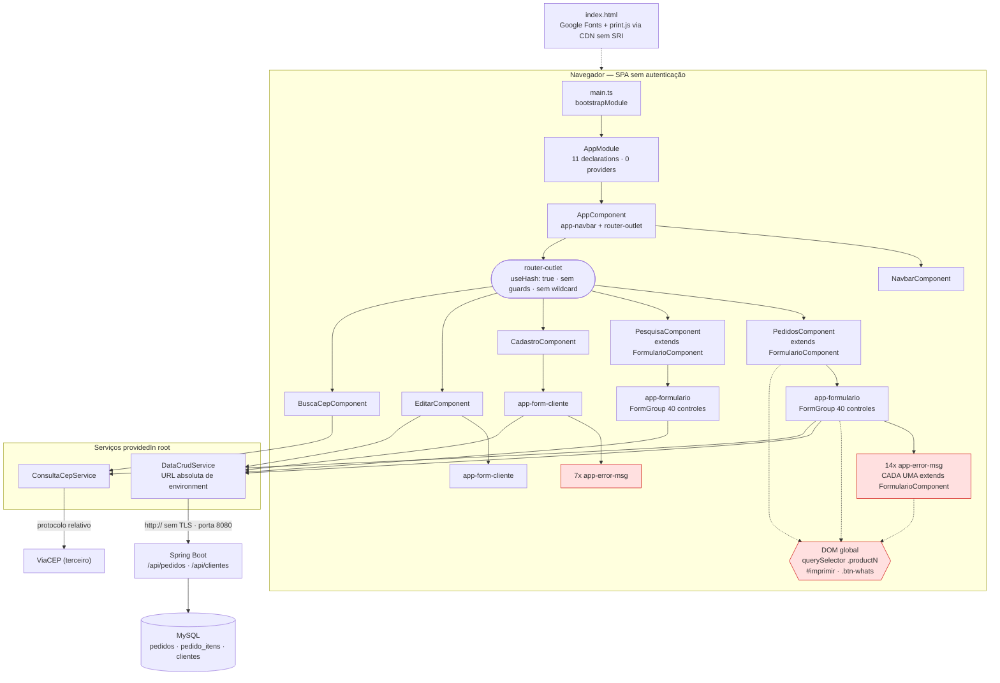
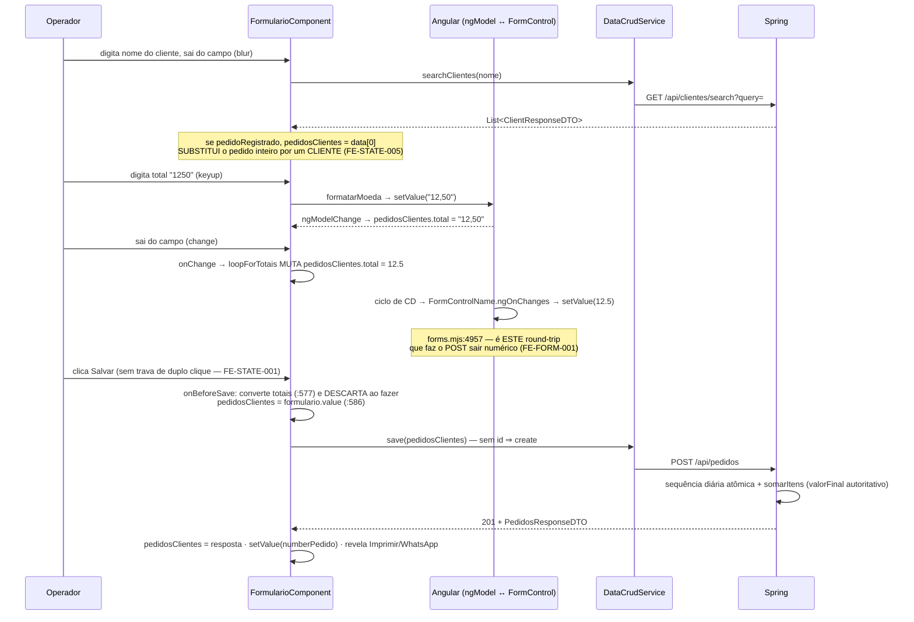

# Auditoria arquitetural integral — Frontend Angular (Lavanderia Beltrão)

> **Versão pública sanitizada.** Identificadores de infraestrutura (ex.: projeto de deploy) e caminhos locais do ambiente de auditoria foram removidos ou generalizados para publicação neste repositório. Achados, severidades, evidências de código e recomendações foram preservados.

> **Esta é uma auditoria. Nenhum código, configuração, dependência, environment ou documento
> preexistente foi alterado.** O único arquivo escrito foi este relatório.

---

## 1. Resumo executivo

O frontend é uma SPA Angular 14 pequena (2.556 linhas de TS, 11 componentes, 2 serviços, 6 rotas),
com **governança documental acima da média** — `PROJECT_RULES.md`, `AGENTS.md` e as rules em
`.claude/rules/` descrevem o sistema com honestidade, inclusive nos pontos incômodos (proxy não
exercido, ausência de lint, Firebase não usado no app). O contrato com o backend Spring está
**correto nos pontos que mais importam**: a numeração diária do pedido nasce no `POST` e é adotada
da resposta, e `valorFinal` é autoritativo no servidor — ambos confirmados nos dois lados.

O problema não é a arquitetura escolhida; é a **erosão estrutural concentrada em um único arquivo**
e a **ausência total de rede de segurança**:

- `formulario.component.ts` tem **634 linhas (25% de todo o TS)**, acumula 5 responsabilidades e é
  **estendido por 3 componentes** — incluindo `ErrorMsgComponent`, o que faz a tela de pedido
  instanciar **16 formulários de 40 controles (~640 `FormControl`)** para usar 1.
- A suíte de testes está **vermelha**: 10 de 15 specs falham, e o `karma.conf.js` está configurado
  de forma que `npm test` **nunca termina** em ambiente não interativo. Ou seja, a validação que
  `PROJECT_RULES.md:111` exige antes de qualquer mudança **não funciona hoje**.
- **Zero** `ngOnDestroy`, `takeUntil`, `async` pipe, `OnPush`, `trackBy` ou `catchError` no projeto.
- Todo o caminho do dinheiro trafega como `any`, apesar de `tsconfig.json` estar com `strict: true`
  **e** `strictTemplates: true` — a configuração é rigorosa e está neutralizada por 111 anotações
  `any`/`@ts-ignore`.

**Riscos de produção que exigem decisão do dono, não apenas refactor:** PII de clientes (nome,
telefone, endereço) trafega em **HTTP sem TLS**, numa aplicação **sem autenticação**, com o CRUD
completo exposto; e o botão Salvar **não tem trava de duplo clique**, o que cria pedidos duplicados
com números distintos e sem chave para detectá-los.

**Achado de melhor relação impacto/esforço do relatório:** `firebase.json:10` exige **20** dígitos
hexadecimais no nome do arquivo, mas o Angular 14 emite **16** — o `Cache-Control: immutable`
**nunca é aplicado a nenhum artefato**. Correção de um caractere; recupera cache eterno de ~989 kB.

**Veredito de nível sênior:** o projeto está **abaixo** do nível sênior proporcional ao seu porte em
*testabilidade*, *tipagem efetiva* e *coesão do componente central*; está **no nível** em governança
documental, contrato de API e disciplina de commits; e tem **duas exposições de segurança** que não
são resolvíveis dentro do frontend. Nada disso exige reescrita: 5 das 8 correções de maior valor são
esforço **S** e reversíveis.

**Contagem:** 51 achados — 5 CRÍTICAS, 11 ALTAS, 24 MÉDIAS, 9 BAIXAS, 2 OPORTUNIDADES.

---

## 2. Escopo, HEADs e limitações

### Baseline

| Item | Valor |
|---|---|
| Repositório | `lavanderiaBeltrao_frontend` |
| Branch | `dev` (rastreando `origin/dev`) |
| HEAD | `ef9b264` — *fix(formulario): corrige botao WhatsApp deformado na barra de acoes* (2026-07-27) |
| Working tree | limpo, exceto 1 arquivo não rastreado: `docs/ia-auditorias/AUDITORIA-UX-UI-INTEGRAL-2026-07-27.md` |
| Outras branches | `main` (`6245a56`), `fix/ux-ui` (`bc75aa0`), `refactor/gpt-frontend`, `visualizar-commit-antigo` |
| Histórico | 30 commits, 1 mantenedor efetivo, atividade concentrada em jul/2026 |
| Backend consultado | `../lavanderiaBeltrao_backend` — **somente leitura de contrato** (`dto/`, `controller/`, `service/`, `configs/`, `model/`) |

Todas as referências `arquivo:linha` deste relatório são conferíveis com
`git show ef9b264:<arquivo>`.

### Método

1. Leitura estática integral pelo agente principal (governança → configuração → código → backend).
2. Três subagentes read-only em paralelo: (A) arquitetura/RxJS/forms, (B) integração/segurança,
   (C) testes/build/performance/operação.
3. **Verificação linha a linha pelo agente principal**, com reabertura dos arquivos citados. Achado
   de subagente não entrou aqui sem essa conferência — ver §18 para o caso em que dois subagentes se
   contradisseram e a contradição foi resolvida no código-fonte do Angular.
4. Validações executadas (§18).

### Limitações declaradas

- **Runtime não testado.** A SPA não foi executada; nenhuma navegação real foi feita. Os achados são
  de base estática, salvo os que citam saída de build/teste. A auditoria UX/UI de 2026-07-27 tem a
  mesma limitação; a de 2026-07-26 teve runtime e é creditada onde usada.
- `environment.ts`/`environment.prod.ts`: analisados **apenas na estrutura** (nomes de chave, esquema
  do protocolo, tipo de host). Nenhum valor sensível é reproduzido aqui.
- Backend, banco, Docker, Firebase e rede externa **não foram executados**.
- `.env`/secrets **não foram lidos** (não existem no repositório).
- Nenhum dado pessoal real foi usado em exemplos.

---

## 3. Arquitetura atual

### 3.1 Diagrama real



### 3.2 Cadeia de herança (a peça central)

```
FormCadastroComponent (abstract, @Component com template <div></div> nunca usado)
   │  formulario, submitted, onSubmit, verificaValidacoesForm, aplicaCssErro, resetar, consultarCep
   ├── FormClienteComponent
   └── FormularioComponent (634 linhas · FormGroup de 40 controles · ViewEncapsulation.None)
          ├── PedidosComponent      → e AINDA embute <app-formulario> no template
          ├── PesquisaComponent     → e AINDA embute <app-formulario> no template
          └── ErrorMsgComponent     → 14 instâncias por tela de pedido, 7 por tela de cliente
```

`ErrorMsgComponent` usa da superclasse **um único método** (`aplicaCssErro`, chamado em
`error-msg.component.html:2`) e paga por isso um `FormGroup` de 40 controles, 6 dependências
injetadas e um `ngAfterViewInit` herdado que mexe no DOM global.

### 3.3 Fluxo — registrar pedido



### 3.4 Fluxo — cadastrar/editar cliente

`cadastrar-clientes` → `CadastroComponent` → `<app-form-cliente>`: o `FormGroup`
(`form-cliente.component.ts:24-33`) serve **só para validação**; o que é enviado é o objeto
`@Input() clientes` preenchido por `[(ngModel)]` (`form-cliente.component.ts:47`).
`ngAfterViewInit` decide o contexto **farejando o DOM de outra tela**
(`document.getElementById('pesquisa')`, `:39`).
`editar-clientes` → `EditarComponent` busca **todos** os clientes e filtra no navegador
(`editar.component.ts:41`), embora `searchClientes` exista e já seja usado na tela de pedido.
Após salvar, a lista do pai **não é atualizada** — `<app-form-cliente>` não tem `@Output`.

### 3.5 Fluxo — pesquisa e CEP

`pesquisar-pedido` → `PesquisaComponent` (que **é** um `FormularioComponent`) faz
`searchPedidos(query)` server-side e renderiza `arrPedidos`; o `<app-formulario>` **filho** é quem
salva a edição e avisa o pai por `@Output() pedidoEditado` → `searchPedido()`.
CEP: `consultaCEP` valida `^[0-9]{8}$` e, se falhar, devolve `of({})` — indistinguível de sucesso
vazio. `consultaRUA` monta a URL com o nome da cidade **não encodado** e acumula resultados entre
buscas (`busca-cep.component.ts:79-82`, sem limpar os arrays).

---

## 4. Scorecard (0–5)

| Dimensão | Nota | Justificativa em uma linha |
|---|:--:|---|
| A. Arquitetura Angular | **2** | Rotas e módulo corretos; herança acidental e God Component de 634 linhas dominam o resto. |
| B. Estado / RxJS / ciclo de vida | **2** | Padrão `take(1)` majoritário e erro tratado em 9/11 subscribes; zero teardown, zero concorrência, 4 fontes da verdade. |
| C. Reactive Forms e regras de negócio | **2** | Regras de domínio corretas; `ngModel`+`formControlName` em 40 campos e validação quase inexistente. |
| D. Integração com o backend | **4** | Contrato casa com os DTOs; numeração e `valorFinal` corretos. Perde por tratamento de erro cego e tipagem `any`. |
| E. Segurança e privacidade | **1** | Sem TLS, sem autenticação, PII em console. Nenhum XSS — o Angular protege por padrão. |
| F. UX/UI e acessibilidade | **2** | Ver relatório dedicado: 6 críticos, 30 importantes. |
| G. Performance | **2** | Build passa; 16 formulários por tela, bundle a 35 kB do budget de erro, cache de produção inoperante. |
| H. Testes e qualidade | **1** | Suíte vermelha, `npm test` não terminável, zero teste de comportamento, sem lint. |
| I. Operação e evolução | **2** | Deploy funciona; Docker não reproduz, sem CI, sem observabilidade, stack fora de suporte. |
| **Governança documental** | **5** | Rules, PROJECT_RULES e AGENTS descrevem o sistema com precisão e honestidade incomuns. |

---

## 5. Achados validados

Legenda de status: **feito** / **não feito** / **não testado** / **não confirmado no projeto**.
Todos os achados abaixo têm status **não feito** (são diagnósticos, não correções), salvo indicação.

### A. Arquitetura

#### FE-ARCH-001 · Herança acidental: `ErrorMsgComponent extends FormularioComponent`
- **Tipo:** acoplamento estrutural · **Severidade: CRÍTICA** · **Prioridade: P1**
- **Evidência:** `src/app/shared/error-msg/error-msg.component.ts:17`, construtor `:25-34`;
  `src/app/formulario/formulario.component.ts:57-99` (FormGroup de 40 controles);
  `formulario.component.html` — 14 ocorrências de `<app-error-msg>`;
  `form-cliente.component.html` — 7 ocorrências. HEAD `ef9b264`.
- **Estado atual:** cada `<app-error-msg>` constrói um `FormGroup` de 40 controles, injeta 6
  dependências e herda `ngAfterViewInit`. Usa da superclasse **um** método (`aplicaCssErro`).
- **Impacto e probabilidade:** em `registrar-pedido` são **16 instâncias de `FormularioComponent`**
  (1 pai + 1 filho + 14 error-msg) ≈ **640 `FormControl`** vivos, dos quais 40 (6%) participam do
  submit. Probabilidade: 100% (acontece em toda carga da tela).
- **Cenário concreto:** as 14 instâncias executam `aplicarEstadoInicial()`
  (`formulario.component.ts:128-137`), que faz `document.getElementById('pesquisa')` e chama
  `ocultarAcoesPedidoCriado()` — mexendo em `#imprimir` e `.btn-whats` **globais**. Hoje o efeito é
  idempotente. Basta envolver um `<app-error-msg>` em `*ngIf` para que a nova instância esconda
  Imprimir/WhatsApp **de um pedido já salvo**.
- **Recomendação mínima:** remover `extends FormularioComponent`; inlinar `aplicaCssErro` e
  `verificaValidTouched` (~10 linhas) e apagar o construtor de 6 dependências.
- **Esforço:** S · **Dependências:** nenhuma · **Breaking change:** não · **Impacto no backend:** nenhum
- **Testes de aceite:** a tela de pedido renderiza as 14 mensagens de erro como antes; Imprimir e
  WhatsApp continuam ocultos em `registrar-pedido` e visíveis em `pesquisar-pedido`.
- **Rollback:** reverter o commit · **ADR:** não · **Confiança:** alta

#### FE-ARCH-002 · `FormularioComponent` é um God Component com 5 responsabilidades
- **Severidade: ALTA** · **P2**
- **Evidência:** `formulario.component.ts` — 634 linhas, 33 métodos. Formulário/máscara (`:294`,
  `:280`, `:307`); HTTP (`:157`, `:173`, `:231`, `:242`, `:591`); DOM/apresentação (`:143`, `:376`,
  `:386`); domínio/recibo (`:397`, `:472`, `:262`); plataforma (`mobileCheck:560`, regex de
  user-agent de uma linha em `:563` com `@ts-ignore` em `:562`).
- **Impacto:** qualquer mudança em máscara, recibo ou HTTP toca o mesmo arquivo — e, como 3
  componentes o estendem, o raio de alcance são **todas as rotas**.
- **Recomendação mínima:** **não** refatorar em bloco. Extrair primeiro o par duplicado
  (FE-ARCH-008), depois `mobileCheck` para `shared/`.
- **Esforço:** M (incremental) · **Reversível:** sim · **ADR:** não · **Confiança:** alta

#### FE-ARCH-003 · Estado de UI vive no DOM; `slotsVisiveis` é uma segunda verdade não usada
- **Severidade: ALTA** · **P2**
- **Evidência:** 27 acessos diretos ao DOM em `src/app/**/*.ts`, concentrados em
  `formulario.component.ts:129,135,144-146,151-153,371-373,379-381,389-391,533-535,552-553,574`;
  regras CSS em `formulario.component.scss:53` (`.remove`) e `:56` (`.add`).
  `slotsVisiveis` (`:46`) **não aparece em nenhum ponto do template** — é lido apenas em
  `novoCampo()` (`:346-348`).
- **Impacto:** a verdade sobre "o item está visível?" é a classe CSS, não o componente. Testes não
  conseguem verificar estado, e as queries são no `document` inteiro.
- **Cenário concreto:** com dois `<app-formulario>` na mesma página,
  `document.querySelector('.product1')` acerta sempre o primeiro — o segundo nunca revela nada.
- **Recomendação mínima:** `[class.add]="slotsVisiveis[0]"` / `[class.remove]="!slotsVisiveis[0]"`
  nas 5 divs `.productN` (`formulario.component.html:200,255,309,363,417`) e apagar as 3 linhas de
  `classList`.
- **Esforço:** S · **Testes de aceite:** adicionar, remover e editar itens 1..5 mantém o
  comportamento visual · **ADR:** não · **Confiança:** alta

#### FE-ARCH-004 · Quatro fontes da verdade, e o modo é decidido por *parsing da URL*
- **Severidade: ALTA** · **P1**
- **Evidência:** (1) `pedidosClientes` (`any`, ligado por `[(ngModel)]` em 40 pontos); (2) o
  `FormGroup` de 40 controles; (3) `slotsVisiveis` (`:46`); (4) classes CSS no DOM.
  A escolha do que é enviado está em `formulario.component.ts:574` (`window.location.hash.slice(2)`)
  e `:586` (`url == 'registrar-pedido' ? this.pedidosClientes = this.formulario.value : ...`).
- **Impacto:** duas semânticas de "verdade" no mesmo método, selecionadas por string de URL.
- **Cenário concreto:** qualquer mudança de rota (prefixo, query string, sub-rota) faz a comparação
  virar `false`; a **criação** passaria a enviar `pedidosClientes`, que **contém `id`** quando o
  objeto veio de um POST anterior → `save()` (`data-crud.service.ts:30-35`) escolhe `update()` → o
  pedido novo **sobrescreve o anterior**.
- **Recomendação mínima:** trocar o parsing da URL por `@Input() modo: 'criar' | 'editar'` passado
  pelo pai (uma linha em `pedidos.component.html:5` e `pesquisa.component.html:48`).
- **Esforço:** S/M · **Breaking change:** não · **ADR:** não · **Confiança:** alta

#### FE-ARCH-005 · `PedidosComponent` herda **e** embute `FormularioComponent`
- **Severidade: MÉDIA** · **P2**
- **Evidência:** `pedidos.component.ts:15` + `pedidos.component.html:5`; idem
  `pesquisa.component.ts:14` + `pesquisa.component.html:48`.
- **Estado atual:** em `registrar-pedido` o pai **não usa nada** do que herda; seu único código é
  `ngOnInit` (`pedidos.component.ts:28-34`), que faz
  `document.querySelector('.btn-whats').style.display = 'none'` **sem guarda de nulidade** —
  enquanto a versão da superclasse (`formulario.component.ts:153-154`) usa `if (whats)`.
- **Cenário concreto:** se a ordem de renderização mudar (ex.: `<app-formulario>` dentro de `*ngIf`),
  `ngOnInit` lança `TypeError` e a rota inicial quebra. *A hipótese de que isso já ocorre foi
  **refutada** pela auditoria UX/UI (runtime, 2026-07-26): no Ivy o DOM da subárvore existe antes do
  `ngOnInit` do pai.*
- **Recomendação mínima:** deletar `ngOnInit` de `pedidos.component.ts:28-34` — é duplicata de
  `ocultarAcoesPedidoCriado()`, que já roda no filho.
- **Esforço:** S (deletar) / M (remover a herança) · **Confiança:** alta

#### FE-ARCH-006 · `implements ChangeDetectorRef` com 5 métodos vazios
- **Severidade: MÉDIA** · **P2**
- **Evidência:** `formulario.component.ts:18-23` — `implements ... ChangeDetectorRef` com
  `checkNoChanges(){}`, `detach(){}`, `detectChanges(){}`, `markForCheck(){}`, `reattach(){}`.
  Simultaneamente **injeta** um `ChangeDetectorRef` real (`:54`) que não é usado (o único uso estava
  em `ngAfterViewChecked`, comentado em `:102-105`).
- **Impacto:** o componente satisfaz o **tipo** `ChangeDetectorRef` sem cumprir o contrato. Qualquer
  código que receba `this` como `ChangeDetectorRef` chamará `detectChanges()` que **não faz nada** —
  falha silenciosa. As 3 subclasses herdam esse contrato falso. É também uma armadilha para uma
  eventual adoção de `OnPush`.
- **Recomendação mínima:** remover `, ChangeDetectorRef` do `implements` e os 5 métodos.
- **Esforço:** S · **ADR:** não · **Confiança:** alta

#### FE-ARCH-007 · `FormCadastroComponent` usa `@Component` onde deveria usar `@Directive`
- **Severidade: MÉDIA** · **P3**
- **Evidência:** `form-cadastro.component.ts:6-10` — `@Component({selector:'app-form-cadastro',
  template:'<div></div>'})` sobre uma **classe abstrata**. Não está em `app.module.ts:25-37`; o
  seletor não aparece em nenhum template.
- **Impacto:** baixo hoje; o Angular rejeita classe abstrata em `declarations`, então o erro só
  aparece se alguém tentar declará-la. Em Angular 14 o correto para base decorada é `@Directive()`
  sem seletor.
- **Recomendação mínima:** trocar por `@Directive()`. **Esforço:** S · **Confiança:** alta

#### FE-ARCH-008 · ~60 linhas duplicadas entre `enviarPedidoCliente()` e `imprimir()`
- **Severidade: MÉDIA** · **P2**
- **Evidência:** `formulario.component.ts:397-470` vs `:472-557`. Idênticos em: normalização de
  telefone (`:417-421` vs `:490-492`), `loopForTotais` (`:422` vs `:494`), loop de extração
  (`:427-443` vs `:499-512`), montagem de `newmsg` (`:445-451` vs `:514-520`) e cadeia de status
  (`:454-462` vs `:523-531`). Diferem só no destino.
- **Impacto comprovado:** o commit `9b784cf` ("corrige desalinhamento do array pesagem") teve de
  corrigir **o mesmo bug duas vezes** — os comentários em `:433-437` e `:505-506` dizem isso
  explicitamente ("mesmo bug, mesma correção").
- **Recomendação mínima:** extrair `private montarResumoPedido(pedido)` devolvendo
  `{linhas, total, status, entrega}`; os dois métodos ficam só com o destino.
- **Esforço:** M · **Testes de aceite:** recibo impresso e mensagem de WhatsApp byte-idênticos aos
  atuais para um pedido com 1, 3 e 6 itens · **ADR:** não · **Confiança:** alta

#### FE-ARCH-009 · Inventário de código morto
- **Severidade: MÉDIA (higiene)** · **P3**
- **Evidência (todas verificadas por grep em `src/`):**
  | Item | Evidência |
  |---|---|
  | `InputClientComponent` inteiro (78 linhas + html + scss + spec) | declarado em `app.module.ts:34`, seletor `app-input-client` **em nenhum template** |
  | `MatRadioModule` | importado/exportado em `app.module.ts:21,47,51`; `mat-radio` em **0** templates |
  | `exports: [...]` do `AppModule` | `app.module.ts:49-52` — módulo raiz não é importado por ninguém |
  | `DataCrudService.list()` | `data-crud.service.ts:19-21` — **nenhum call site** |
  | `import {empty} from "rxjs"` | `formulario.component.ts:9` — não usado; API removida no RxJS 8 |
  | `import {delay}` | `data-crud.service.ts:4` — os 2 usos estão comentados (`:25`, `:55`) |
  | `@ViewChild('pedidoNum')` | `formulario.component.ts:27` — a ref `#pedidoNum` não existe no template |
  | `@Input() numberPedido` / `@Input() arrPedidos` | `:25`, `:28` — nunca bindados (`pesquisa.component.html:48` passa só `pedidosClientes`) |
  | Campos `vf`, `d`, `classField`, `test` | `:36`, `:38`, `:39`, `:40` |
  | `i`, `np` na base | `form-cadastro.component.ts:14,15` |
  | `FormValidations.cepValidator` e `requiredMinCheckbox` | `form-validations.ts:5`, `:19` — sem consumidor |
- **Nuance:** `vf` é passado a `loopForTotais(this.vf, ...)` (`:577`), mas o método **reatribui o
  parâmetro** na primeira linha (`:263`, `valor = []`) — `this.vf` permanece `[]` para sempre.
- **Recomendação mínima:** um commit único de remoção, sem tocar em comportamento.
- **Esforço:** S · **Rollback:** git · **Confiança:** alta

#### FE-ARCH-010 · `<form>` aninhado dentro de `<form>`
- **Severidade: BAIXA** · **P3**
- **Evidência:** `pesquisa.component.html:4` envolve `:48` (`<app-formulario>`), cujo template raiz é
  outro `<form>` (`formulario.component.html:1`). Mesmo padrão em `editar.component.html:2`/`:44`.
- **Estado atual:** HTML inválido; funciona porque o Angular cria os nós via DOM API. O `submit` do
  form interno borbulha para o externo (hoje inofensivo, pois o externo não tem `(ngSubmit)`).
- **Recomendação mínima:** trocar o `<form>` externo por `<div [formGroup]="formulario">`.
- **Esforço:** S · **Confiança:** alta

### B. Estado, RxJS e ciclo de vida

#### FE-STATE-001 · Salvar sem trava de duplo clique → **pedido duplicado em produção**
- **Severidade: CRÍTICA** · **P0**
- **Evidência:** `formulario.component.ts:591-617` (`submit()` sem flag de "enviando");
  `formulario.component.html:536` (`<button ... type="submit">Salvar</button>` sem `[disabled]`);
  `form-cadastro.component.ts:26-28`. Mesmo problema em `form-cliente.component.ts:45-55` e nos
  botões de remoção (`pesquisa.component.html:41`, `editar.component.html:38`).
- **Impacto:** cada clique dispara `save()` → `create()` (não há `id` em `registrar-pedido`). Como a
  numeração diária é **atômica no servidor** (ADR 0007), os dois pedidos ganham números
  **diferentes** — não há chave para detectar o duplicado.
- **Cenário concreto:** conexão lenta no balcão, operador clica duas vezes → `20260727-013` e
  `20260727-014` idênticos; o cliente leva um recibo e a lavanderia fica com dois pedidos abertos.
- **Recomendação mínima:** booleano `salvando`: `true` no início de `submit()`, `false` em
  `next`/`error`, e `[disabled]="salvando"` no botão. 4 linhas, sem biblioteca nova.
- **Esforço:** S · **Breaking change:** não · **Impacto no backend:** nenhum
- **Testes de aceite:** com throttling de rede, dois cliques rápidos produzem **um** `POST`.
- **ADR:** não · **Confiança:** alta · **Correlato UX/UI:** achado 2 do relatório de 2026-07-27

#### FE-STATE-002 · Zero teardown; 3 subscribes sem operador de completação
- **Severidade: ALTA** · **P2**
- **Evidência:** grep em `src/**/*.ts` e `*.html` por `ngOnDestroy|takeUntil|unsubscribe|async `:
  **zero ocorrências**. Sem `take(1)`/`first()`: `editar.component.ts:41` → `data-crud.service.ts:50`;
  `busca-cep.component.ts:76` → `consulta-cep.service.ts:31`; `form-cadastro.component.ts:61` →
  `consulta-cep.service.ts:23`.
- **Nuance que evita falso positivo:** todos são `HttpClient`, que **completa** após a resposta —
  **não há vazamento de memória permanente**. O risco real é o callback executar depois da destruição
  do componente.
- **Cenário concreto:** o operador digita o CEP, o `(blur)` dispara `consultarCep()` e ele navega
  imediatamente; a resposta do ViaCEP chega e executa `patchValue()` (`form-cadastro.component.ts:64-70`)
  num formulário de componente já destruído.
- **Recomendação mínima:** adicionar `take(1)` **nos serviços** nos 3 pontos, mantendo o padrão que
  o projeto já usa em 8 dos 11 casos. **Não** introduzir `takeUntil`+`Subject` em 11 lugares.
- **Esforço:** S · **Confiança:** alta · **Divergência com rule:** ver FE-DOC-004

#### FE-STATE-003 · Sem controle de concorrência nas buscas (vence a última resposta, não a última pergunta)
- **Severidade: MÉDIA** · **P2**
- **Evidência:** `formulario.component.ts:165-171`, `:249-259`; `editar.component.ts:38-52`. Zero
  `switchMap`/`debounceTime` no projeto.
- **Cenário concreto:** busca "ana", corrige para "ana paula" e clica de novo; a resposta de "ana"
  chega atrasada e sobrescreve `arrPedidos` — um clique em "Editar" abre o pedido errado.
- **Recomendação mínima:** desabilitar o botão de busca enquanto a request está em voo (mesma flag
  de FE-STATE-001). `switchMap` **não recomendado agora** — só se surgir busca-enquanto-digita.
- **Esforço:** S · **Confiança:** média-alta

#### FE-STATE-004 · `loopForTotais()` muta o modelo — clicar em "Imprimir" altera o formulário
- **Severidade: MÉDIA** · **P2**
- **Evidência:** `formulario.component.ts:262-278` — `valor.push(this.pedidosClientes.total = pedido[i][1])`
  nas linhas `:269-274`. Chamado por `onChange():285`, `enviarPedidoCliente():422`, `imprimir():494`
  e `onBeforeSave():577`.
- **Impacto:** `imprimir()` e `enviarPedidoCliente()` são leituras do ponto de vista do usuário, mas
  mutam o objeto ligado por `[(ngModel)]` — e a mutação volta ao `FormControl` no ciclo seguinte.
- **Cenário concreto:** o operador digita `12,50`, clica em "Imprimir", e o campo Total passa a
  exibir `12.5`.
- **Recomendação mínima:** remover as 6 atribuições de `:269-274`, mantendo só o `push`; deixar a
  conversão explícita em `onBeforeSave()`.
- **Esforço:** S · **Atenção:** interage com FE-FORM-001 — corrigir os dois juntos, na ordem indicada
  no roadmap · **Confiança:** média-alta

#### FE-STATE-005 · `consultarCliente()` substitui o pedido inteiro por um registro de cliente
- **Severidade: MÉDIA (UX: CRÍTICA)** · **P1**
- **Evidência:** `formulario.component.ts:249-259` — `this.pedidosClientes = match`, onde `match` é
  um `Clientes` (`shared/clientes.ts:1-13`: 9 campos, **sem** `total*`, `descricao*`, `valorFinal`).
  Disparado por `(blur)` em `formulario.component.html:14`.
- **Impacto:** todos os `[(ngModel)]` de item passam a apontar para propriedades inexistentes; e
  `match.id` — um **id de cliente** — entra em `pedidosClientes.id`, o que em modo edição levaria a
  `PUT /api/pedidos/{idDoCliente}`.
- **Recomendação mínima:** trocar por `patchValue` apenas dos campos de endereço/telefone, **sem `id`**.
- **Esforço:** S · **Impacto no backend:** evita PUT em recurso errado · **Confiança:** alta
- **Correlato UX/UI:** achado 1 (crítico) do relatório de 2026-07-27

#### FE-STATE-006 · Sem estado de carregamento e sem estado vazio
- **Severidade: MÉDIA** · **P2**
- **Evidência:** nenhuma propriedade de loading em nenhum dos 13 componentes; tabelas sem branch de
  vazio (`pesquisa.component.html:27`, `editar.component.html:24`); 2 dos 11 subscribes só logam no
  console (`form-cadastro.component.ts:77`, `busca-cep.component.ts:85`).
- **Recomendação mínima:** linha "Nenhum resultado encontrado" via `*ngIf` nas duas tabelas e
  snackbar no lugar do `console.error` do CEP.
- **Esforço:** S · **Confiança:** alta

### C. Reactive Forms e regras de negócio

#### FE-FORM-001 · A normalização dos totais depende de um efeito colateral de *timing*
- **Severidade: ALTA** · **P1** · *(este achado corrige uma leitura inicial mais alarmista — ver §18)*
- **Evidência:** `formulario.component.ts:294-305` (`formatarMoeda` grava `"12,50"` no controle);
  `:577` (`loopForTotais` converte para número **no objeto** `pedidosClientes`, não no controle);
  `:586` (`pedidosClientes = this.formulario.value` **descarta** essa conversão no fluxo de criação);
  `:583` (contraste: `valorFinal` **é** normalizado no controle, sincronamente).
  Backend: `PedidosRequestDTO.java:23,27,31,35,39,43` — `BigDecimal total…total5`; nenhum
  `@JsonDeserialize`, `ObjectMapper` customizado ou `spring.jackson.*` no backend.
- **O que de fato acontece (verificado no código-fonte do Angular):** ao sair do campo, o `(change)`
  chama `onChange()` → `loopForTotais` muta `pedidosClientes.totalN` para número → no ciclo de
  detecção seguinte, `FormControlName.ngOnChanges` detecta a mudança do `[(ngModel)]` e chama
  `FormGroupDirective.updateModel` → `ctrl.setValue(...)` **de forma síncrona**
  (`node_modules/@angular/forms/fesm2015/forms.mjs:4957-4960`). Quando o Salvar é clicado, o
  `formulario.value` **já contém números**. **O POST sai com o tipo correto.**
- **Impacto:** o contrato financeiro está correto **por acidente**, não por construção. O código que
  deveria garanti-lo (`:577`) tem seu resultado descartado três linhas adiante. Qualquer mexida em
  `(change)`, na ordem de eventos ou em `loopForTotais` quebra o `POST` — e a falha aparece só como
  `ERRO AO SALVAR PEDIDO!!!` (`:631`), sem detalhe.
- **Cenário concreto de regressão:** alguém remove o `(change)="onChange()"` dos campos de total (por
  parecer redundante com o `keyup`) → o `POST` passa a enviar `"12,50"` → Jackson não converte para
  `BigDecimal` → 400 → mensagem genérica → o pedido é perdido no balcão.
- **Recomendação mínima:** em `onBeforeSave()`, normalizar os totais **no próprio form**, como já se
  faz com `valorFinal`: laço sobre `['', '1'..'5']` chamando `this.formulario.get('total'+n)?.setValue(...)`
  **antes** da linha `:586`. Elimina a dependência de timing sem mudar o contrato.
- **Esforço:** S · **Breaking change:** não · **Impacto no backend:** nenhum (passa a cumprir o
  contrato já existente)
- **Testes de aceite:** teste unitário de `onBeforeSave` provando que `total*` sai numérico **sem**
  disparar `onChange` antes; e verificação no DevTools → Network do corpo do `POST /api/pedidos`.
- **Rollback:** reverter o commit · **ADR:** não · **Confiança:** alta no mecanismo; **runtime não
  testado**

#### FE-FORM-002 · `[(ngModel)]` + `formControlName` em 40 campos (API removida no Angular 17)
- **Severidade: ALTA** · **P2**
- **Evidência:** 40 ocorrências de `ngModel` em `formulario.component.html`, sempre ao lado de
  `formControlName`; mesmo padrão em `form-cliente.component.html:12,26,41,56,72,86,102,115`.
- **Impacto:** o Angular emite o warning `ngModelWithFormControlName` desde a v6 e **removeu** a
  combinação na v17 — é um **bloqueador de atualização**. É também a mecânica que cria as duas
  "verdades" de FE-ARCH-004 e que torna FE-FORM-001 dependente de timing.
- **Recomendação mínima:** **não** remover os 40 de uma vez. Migrar o fluxo de edição para
  `patchValue(pedido)` em `onEdit()` + leitura de `formulario.value` no submit; os `ngModel` saem
  em bloco e `pedidosClientes` vira apenas o objeto de resposta.
- **Esforço:** L · **Dependências:** exige FE-TEST-002 antes · **Breaking change:** não (interno)
- **Testes de aceite:** criar, editar e imprimir um pedido com 6 itens produz exatamente o mesmo
  payload e o mesmo recibo · **ADR:** **sim** — vira convenção do projeto · **Confiança:** alta

#### FE-FORM-003 · Botão "Cancelar" sem `type="button"` dispara submit
- **Severidade: MÉDIA** · **P0 (quick win)**
- **Evidência:** `formulario.component.html:537` e `form-cliente.component.html:124`, ambos dentro de
  `<form (ngSubmit)>`. Contraste com os botões corretos: `:538`, `:490`, `:252,306,360,414,471`.
- **Impacto:** o clique executa `resetar()` e em seguida dispara `ngSubmit` → `onSubmit()` →
  `verificaValidacoesForm()` marca **todos** os controles como `touched`/`dirty`: o operador cancela
  e recebe a tela limpa coberta de alertas vermelhos.
- **Nuance:** **não** se aplica a `busca-cep.component.html:73` — aquele form não tem `(ngSubmit)` e
  o `FormGroupDirective.onSubmit` retorna `false` (correção registrada pelo validador da auditoria
  UX/UI).
- **Recomendação mínima:** adicionar `type="button"` nos **2** botões.
- **Esforço:** S · **Confiança:** alta · **Correlato UX/UI:** achados 4 e 37

#### FE-FORM-004 · Validação quase inexistente; dois validadores caseiros nunca usados
- **Severidade: MÉDIA** · **P2**
- **Evidência:** `formulario.component.ts:59,61,62,71` — apenas `data`, `cliente`, `telefone` e
  `descricao` têm `Validators.required`; **nenhum** validador em `total*`, `quantidade*`, `cep`,
  `entrega_estimada`. `form-validations.ts:5-17` (`cepValidator`) e `:19-33`
  (`requiredMinCheckbox`) **sem nenhum consumidor**. Backend valida os mesmos 4 campos
  (`PedidosClientsController.java:107-110`) — **alinhado**.
- **Impacto:** infraestrutura de erro (`<app-error-msg>` em 10 campos de item) pendurada em
  controles **sem validador** — nunca exibe nada. E é possível salvar item com descrição sem total.
- **Divergência de regra entre telas:** o pedido exige `pattern="[0-9]{10,12}"` no telefone; o
  cadastro de cliente não exige nada — o mesmo telefone aceito numa tela é recusado na outra.
- **Ausência de limite:** `telefone` é `varchar(12) NOT NULL` (`Client.java:19-20`,
  `Pedidos.java:29-30`) e **nenhum dos dois lados** valida tamanho → 15 caracteres viram
  `DataIntegrityViolation` → **500** → snackbar genérica.
- **Recomendação mínima:** aplicar `FormValidations.cepValidator` no controle `cep` (1 linha em
  `:63`) e `Validators.maxLength(12)` no telefone dos dois formulários.
- **Esforço:** S · **Impacto no backend:** a defesa real é `@Size` no servidor · **Confiança:** alta

#### FE-FORM-005 · Sem foco no primeiro campo inválido
- **Severidade: MÉDIA** · **P2**
- **Evidência:** `formulario.component.ts:614-616` (snackbar genérico);
  `form-cadastro.component.ts:30-39` marca tudo como touched sem chamar `focus()`. Nenhum `.focus()`
  ou `scrollIntoView` em todo o `src/`.
- **Nuance:** o snackbar `'FORMULARIO INVALIDO!!!'` é **inalcançável** pelo botão Salvar —
  `onSubmit()` só chama `submit()` se o form for válido (rebaixado a "melhoria" pelo validador
  UX/UI, achado 19).
- **Recomendação mínima:** em `verificaValidacoesForm`, focar o primeiro inválido — os `id` dos
  inputs já coincidem com os nomes dos controles (premissa que `formatarMoeda:303` já explora).
- **Esforço:** S · **Confiança:** alta

#### FE-FORM-006 · `id` do DOM acoplado ao nome do `FormControl`
- **Severidade: MÉDIA** · **P3**
- **Evidência:** `formulario.component.ts:303-304` (`let campo = e.target.id`) e `:308-310`, seguido
  de um `switch` de 6 casos idênticos (`:311-336`).
- **Impacto:** renomear ou remover um `id` no template faz `formulario.get(undefined)` retornar
  `null`; o `?.` engole o erro e a máscara **para de funcionar sem exceção e sem log**.
- **Recomendação mínima:** passar o nome pelo template — `(keyup)="formatarMoeda($event, 'total1')"`
  e `(change)="pesarRetirada($event, 'retirada1')"`, o que colapsa o `switch` de 26 linhas em 2.
- **Esforço:** S/M · **Confiança:** alta

#### FE-FORM-007 · Campos de controle de UI vazam para o payload da API
- **Severidade: BAIXA** · **P3**
- **Evidência:** `formulario.component.ts:58` (`search`) e `:98` (`textarea`) são controles do mesmo
  `FormGroup` do pedido; `onBeforeSave():587` remove **só** `search`. O controle `textarea` está
  ligado ao `<textarea id="printJS-form">` do recibo (`formulario.component.html:540`).
- **Impacto:** o `POST` de criação leva o **corpo inteiro do recibo** em `textarea` e
  `numberPedido: ''`. O Spring ignora propriedades desconhecidas por padrão — inofensivo hoje, mas
  é tráfego e ruído de contrato.
- **Recomendação mínima:** tirar `search` e `textarea` do `FormGroup` do pedido; o `delete` mágico de
  `:587` sai junto.
- **Esforço:** S · **Confiança:** média (validar que `printJS` continua achando `#printJS-form`)

#### FE-FORM-008 · `FormClienteComponent.submit()`: snackbar duplicado e API depreciada
- **Severidade: BAIXA** · **P3**
- **Evidência:** `form-cliente.component.ts:47-54` — `onSuccess()` é chamado incondicionalmente em
  `:49` **e de novo** pelo ternário em `:50`. É também o único `.subscribe()` do projeto com
  callbacks posicionais (depreciados no RxJS 7, removidos no 8); os outros 10 usam `{next, error}`.
- **Recomendação mínima:** remover a linha `:49` e converter para `{next, error}`.
- **Esforço:** S · **Confiança:** alta

#### FE-FORM-009 · Estrutura achatada em 6 slots, sem `FormArray` — **decisão: manter**
- **Severidade: OPORTUNIDADE** · **Classificação: não fazer agora**
- **Evidência:** `formulario.component.ts:57-99` (FormGroup plano); nenhum `FormArray` em nenhum
  componente. O achatamento **é o contrato do backend** (`PedidosRequestDTO.java:20-44` tem os mesmos
  6 slots), embora o banco armazene normalizado (`pedido_itens`, ADR 0005).
- **Análise:** migrar para `FormArray` exigiria uma camada de mapeamento `FormArray ↔ 6 slots` e a
  reescrita do template, **sem mudar nada para o usuário**, em campo financeiro. Custo alto, risco
  alto, benefício nulo enquanto o DTO for achatado.
- **Gatilho de adoção:** somente se o backend passar a expor `itens[]` no contrato.
- **Melhoria com ganho real hoje:** `*ngFor` sobre `[1,2,3,4,5]` no template elimina 5 cópias de
  ~55 linhas de HTML mantendo os nomes `total1..total5`. **Esforço:** M · **Confiança:** alta

### D. Integração com o backend

#### FE-API-001 · Tratamento de erro HTTP uniforme e cego
- **Severidade: ALTA** · **P1**
- **Evidência:** zero `catchError`/`throwError`/`retry`/`timeout` em `src/`. Todos os handlers
  ignoram o argumento: `formulario.component.ts:169,207,238,258,612`; `editar.component.ts:50,57,68`;
  `form-cliente.component.ts:53`. O backend devolve corpo útil que é descartado:
  `PedidosClientsController.java:117-119` e `ClientController.java:114-116` retornam
  `400 {"erro": "<motivo>"}`.
- **Impacto:** 400 (validação), 404 (registro apagado em outra aba), 0 (backend fora do ar, CORS,
  mixed content) e 500 produzem **exatamente a mesma frase**. O operador não distingue "faltou
  preencher" de "servidor caiu"; o suporte não tem trilha.
- **Cenário concreto:** backend responde `400 {"erro":"data, cliente, telefone e descricao sao
  obrigatorios"}`; a tela mostra `ERRO AO SALVAR PEDIDO!!!` e a operadora repete a tentativa
  idêntica indefinidamente.
- **Recomendação mínima:** usar o erro que já chega no callback —
  `error: (e) => this._snackBar.open(e?.error?.erro ?? (e.status === 0 ? 'SEM CONEXÃO COM O SERVIDOR' : 'ERRO AO SALVAR PEDIDO'), ...)`.
  Mudança local em 9 handlers. **`HttpInterceptor` global: não recomendado agora** (ver §14).
- **Esforço:** S/M · **Impacto no backend:** nenhum · **Confiança:** alta

#### FE-API-002 · `editar-clientes` baixa a base inteira a cada busca
- **Severidade: MÉDIA (privacidade + escala)** · **P1**
- **Evidência:** `editar.component.ts:38-52` usa `listClient()` (`GET /api/clientes` sem paginação) e
  filtra com `includes()` no navegador. `searchClientes(query)` **já existe**
  (`data-crud.service.ts:90-94`) e já é usado em `formulario.component.ts:249`; o backend suporta
  `LIKE` por nome ou telefone (`ClientController.java:42-50`).
- **Cenário concreto:** com 5.000 clientes, uma busca por "ana" transfere 5.000 registros completos
  (nome + telefone + endereço) para exibir 3 linhas.
- **Nuance adicional:** buscar com o campo vazio faz `client` ser `undefined` e
  `elm.includes(undefined)` comparar com a string `"undefined"` — nunca casa, e a base foi baixada
  do mesmo jeito.
- **Recomendação mínima:** trocar por `searchClientes(query)` com a guarda de query vazia de
  `formulario.component.ts:160-163`.
- **Esforço:** S · **Breaking change:** não (endpoint já existe e tem consumidor) · **Confiança:** alta

#### FE-API-003 · `proxy.conf.js` é configuração morta — e aponta o dev para **produção**
- **Severidade: MÉDIA** · **P2**
- **Evidência:** `proxy.conf.js:1-8` (`context: ['/api']`, target = host **de produção** na 8080,
  `secure: false`); `package.json:6` passa o arquivo ao `ng serve`; `data-crud.service.ts:14-15`
  monta URL **absoluta**.
- **Análise:** o proxy do `ng serve` só intercepta requisições cujo path casa com `/api` **na origem
  do dev-server**. Com URL absoluta, o navegador vai direto ao backend — o proxy **nunca é acionado**,
  nem em dev; e em produção o dev-server não existe. Confirma o que `PROJECT_RULES.md:89` já declara.
- **Risco real:** se alguém "consertar" as URLs para relativas, o **desenvolvimento passa a escrever
  no banco de produção**.
- **Recomendação mínima:** decidir e documentar — (a) remover o arquivo e a flag; ou (b) esvaziar
  `backend.baseUrl` em `environment.ts` e apontar o target do proxy para o **backend local**.
- **Esforço:** S · **ADR:** recomendável (afeta contrato de ambiente) · **Confiança:** alta

#### FE-API-004 · Tipagem fraca no ponto mais crítico; contrato duplicado em 3 lugares
- **Severidade: MÉDIA** · **P2**
- **Evidência:** assinaturas `any` no serviço (`data-crud.service.ts:23,30,45,53,61,68,78`); 4
  chamadas `http.get/post` **sem genérico** (`:24,38,54,69`); cast para burlar o tipo (`:73-74`);
  estado do componente em `any` (`formulario.component.ts:26`, `:36-40`; `editar.component.ts:18-20`).
  Contagem: **111** ocorrências de `any`/`@ts-ignore` em `src/` (60 só em `formulario.component.ts`).
  O contrato vive em 3 arquivos mantidos à mão: `pedidos-clientes.ts` (44 campos),
  `PedidosRequestDTO.java` (36), `PedidosResponseDTO.java` (41).
- **Impacto:** `tsconfig.json` está com `strict: true` **e** `strictTemplates: true` — configuração
  rigorosa, **neutralizada** exatamente no caminho do dinheiro. Nenhuma divergência da matriz de
  contrato (§7) é detectável em tempo de compilação.
- **Recomendação mínima:** tipar **um** ponto de entrada — `@Input() pedidosClientes: Partial<PedidosClientes>`
  — e medir quantos erros aparecem. Se forem poucos, é o melhor custo-benefício do relatório; se
  forem muitos, é a medida do débito.
- **Esforço:** S (o experimento) / L (tipar tudo) · **Geração automática de tipos: não recomendada**
  (2 recursos, 1 serviço, sem OpenAPI publicado) · **Confiança:** alta

#### FE-API-005 · Método morto e paginação nunca usada
- **Severidade: BAIXA** · **P3**
- **Evidência:** `data-crud.service.ts:19-21` (`list()`) **sem call site**; os parâmetros `page`/`size`
  que o backend aceita (`PedidosClientsController.java:30-32`, `ClientController.java:27-29`)
  **nunca são enviados**. Os endpoints `/search` não têm paginação nenhuma no servidor.
- **Recomendação:** remover `list()`. Paginação: **não fazer agora** — enquanto o volume for pequeno,
  o custo (contrato `Page<>`) supera o ganho. **Gatilho:** busca perceptivelmente lenta.
- **Esforço:** S · **Confiança:** alta

#### FE-API-006 · Divergências de nulabilidade e de tipo entre o model TS e os DTOs
- **Severidade: BAIXA (latente)** · **P3** · Detalhe completo na matriz da §7.
- **Resumo:** 12 campos declarados **não-opcionais** no TS chegam **nuláveis** do servidor
  (`cep`, `cidade`, `rua`, `numCasa`, `bairro`, `complemento`, `quantidade1..5`, `descricao1..5`,
  as 3 flags de status); `quantidade*` é `string` no TS mas os inputs são `type="number"`;
  `dataOperacional` é `string` no TS e `LocalDate` no DTO (não é lido em nenhum template).
- **Confiança:** alta (comparação campo a campo)

#### FE-API-007 · *(registro, backend)* `ClientController` recebe a **entidade** no corpo
- **Severidade: MÉDIA** · **Fora do escopo de edição desta auditoria**
- **Evidência:** `ClientController.java:60` (`create(@RequestBody Client client)` → `save(client)`) e
  `:72`; a entidade tem `@Id private Long id`. Contraste: pedidos usam DTO de entrada
  (`PedidosClientsController.java:63,75`), que **não tem** `id`.
- **Impacto:** um `POST /api/clientes` com `"id": 7` no corpo faz o JPA executar *merge* e
  **sobrescrever o cliente 7** em vez de criar um novo. O frontend não envia `id` hoje, mas colabora
  com o risco ao tipar como `any` (`data-crud.service.ts:68-69`).
- **Recomendação:** `ClientRequestDTO` sem `id`, espelhando `PedidosRequestDTO`. **Confiança:** alta

### E. Segurança e privacidade

#### FE-SEC-001 · PII de clientes em HTTP sem TLS; conflito estrutural com o Firebase Hosting
- **Severidade: CRÍTICA** · **P0** · *(exige decisão de infraestrutura, não de código)*
- **Evidência:** `src/environments/environment.prod.ts:5` — o `backend.baseUrl` de produção usa
  esquema **`http`** (não `https`), host remoto de domínio próprio e **porta 8080 explícita** (o
  mesmo já documentado em `PROJECT_RULES.md:88`). `angular.json:53-56` faz a troca via
  `fileReplacements`. `firebase.json:1-34` serve `dist/lavanderia` — e o Firebase Hosting entrega
  **sempre HTTPS**. `CorsConfig.java:19-24` libera `http://` e `https://` do domínio e um IP direto
  por `http`.
- **Impacto — duas hipóteses, ambas ruins:**
  (a) se a SPA é servida por HTTPS, toda chamada `http://…:8080` é **active mixed content** e o
  navegador **bloqueia** — aplicação quebrada;
  (b) se a SPA é servida em HTTP puro, **nome, telefone e endereço completo** trafegam em texto claro
  e a resposta pode ser adulterada em qualquer rede intermediária.
- **Cenário concreto:** atendimento pelo celular no Wi-Fi compartilhado da loja; o corpo de
  `GET /api/clientes/search?query=…` é legível por qualquer um na mesma rede.
- **Qual das duas ocorre no ambiente real:** **não confirmado no projeto** — exigiria testar o host.
- **Recomendação mínima:** publicar o backend atrás de TLS (proxy reverso ou certificado no host) e
  alterar **apenas** o esquema em `environment.prod.ts`. O CORS do backend já está preparado para o
  domínio `https`.
- **Esforço:** M (infra) + S (uma linha) · **Breaking change:** não (paths idênticos)
- **Testes de aceite:** `https://…/api/pedidos` responde 200 e o navegador não reporta mixed content.
- **ADR:** **sim** — muda contrato de ambiente · **Confiança:** alta na evidência

#### FE-SEC-002 · SPA sem autenticação com CRUD completo de dados pessoais exposto
- **Severidade: CRÍTICA** · **P0** · *(decisão do dono; a mitigação eficaz é de borda)*
- **Evidência:** `app-routing.module.ts:10-17` — 5 rotas, **nenhum `canActivate`**; `app.module.ts:53`
  — `providers: []`; nenhum `SecurityConfig`/Spring Security no backend;
  `CorsConfig.java:18-27` — `addMapping("/**")` com `PUT/POST/DELETE` e `allowedHeaders("*")`.
- **Impacto:** CORS **não é controle de acesso**. `curl -X DELETE …/api/pedidos/1` funciona sem
  origem alguma. Qualquer um que descubra o host lista, edita e **apaga** clientes e pedidos.
- **Cenário concreto:** um bot que varre a faixa de IP do host encontra `…:8080/api/clientes` e baixa
  a base inteira em uma requisição — `ClientController.java:31-33` devolve `findAll()` completo.
- **Recomendação mínima (proporcional a um sistema interno pequeno):** **não** recomendo SSO/OAuth/WAF
  — desproporcional. O menor passo eficaz é de **borda, fora do código**: fechar a porta 8080 para a
  internet, expor a API só por proxy reverso, e restringir por IP/VPN da loja ou Basic auth no proxy.
  O frontend não muda. Login na aplicação só se isso for inviável.
- **Esforço:** S/M (infra) · **ADR:** **sim** · **Confiança:** alta

#### FE-SEC-003 · 13 `console.log` com dados pessoais no bundle de produção
- **Severidade: MÉDIA** · **P0 (quick win)**
- **Evidência:** 18 ocorrências de `console.*` em `src/`. Com PII:
  `formulario.component.ts:185` e `:255` (pedido/cliente completos — nome, telefone, CEP, rua,
  número, bairro), `:473`, `:477` (pedido a imprimir), `:493` (**telefone com DDI**), `:452`, `:521`,
  `:540` (mensagem com nome, itens e total), `:536` (nó DOM do recibo), `:295` e `:302` (**a cada
  tecla** no campo de valor); `input-client.component.ts:74` (cada blur);
  `form-cliente.component.ts:40,42,46` (sem PII).
  Legítimos (manter): `busca-cep.component.ts:85`, `form-cadastro.component.ts:77`, `main.ts:12`.
- **Fato técnico decisivo:** `angular.json:59,66` (`optimization`/`buildOptimizer`) **não removem
  `console.log`** — o Angular CLI 14 não faz drop de console por padrão. Os logs **estão** no
  `main.js` publicado.
- **Regra violada:** `.claude/rules/seguranca-frontend.md:16` — *"Não logar/expor dados reais de
  clientes em console em produção."*
- **Cenário concreto:** terminal de balcão compartilhado com DevTools aberto acumula nome, telefone e
  endereço de todos os clientes do turno, numa aplicação sem login.
- **Recomendação mínima:** deletar as 13 linhas com dados. Nenhuma alimenta lógica.
- **Esforço:** S · **Rollback:** git · **Confiança:** alta

#### FE-SEC-004 · Scripts de terceiros por CDN sem SRI
- **Severidade: BAIXA/MÉDIA** · **P2**
- **Evidência:** `src/index.html:12` (CSS do print.js) e `:17` (`<script src="https://printjs-…">`) —
  **sem `integrity`, sem `crossorigin`, sem versão fixada**; `:9-11` (Google Fonts). O `print-js`
  **já está no bundle** (`package.json:26` + `formulario.component.ts:8`).
- **Impacto:** a página que renderiza PII executa JavaScript de terceiro sem verificação de
  integridade. Sem rede externa, os ícones viram texto e a impressão degrada — relevante para um
  balcão com internet instável.
- **Recomendação mínima:** remover as duas tags (a lib é local), **validando a impressão antes** —
  o CSS do CDN pode estar sendo usado pelo layout do recibo.
- **Esforço:** S · **Confiança:** média (o JS é comprovadamente duplicado; o CSS precisa de validação
  visual)

#### FE-SEC-005 · CORS com `allowCredentials(true)` sem nenhuma credencial em uso
- **Severidade: BAIXA** · **P3** · *(backend)*
- **Evidência:** `CorsConfig.java:18-27` — 4 origens, incluindo **IP direto em http**, com
  `allowCredentials(true)`. No frontend: nenhum `withCredentials`, nenhum cookie, nada em
  `localStorage`/`sessionStorage` (grep: zero).
- **Impacto:** inócuo hoje; vira problema no dia em que houver autenticação por cookie, pois uma
  origem **sem TLS** poderia enviar credenciais automaticamente.
- **Recomendação:** remover `allowCredentials(true)` enquanto não houver auth por cookie, e remover a
  origem por IP puro. **Confiança:** alta

#### FE-SEC-006 · XSS: **sem risco** — registro para evitar retrabalho
- **Severidade: informativo**
- **Evidência:** única ocorrência de `innerHTML` é `formulario.component.ts:554` —
  `textarea.innerHTML = ''` (string vazia, não dado do usuário). **Nenhuma** ocorrência de
  `bypassSecurityTrust*`, `DomSanitizer`, `eval` ou `[innerHTML]` em templates. Toda exibição de PII
  usa interpolação `{{ }}`, que o Angular escapa.
- **Conclusão:** não há vetor de XSS. Nenhuma ação necessária.

### G. Performance

#### FE-PERF-001 · 16 formulários por tela — ver FE-ARCH-001
- **Severidade: ALTA (perf)** · **P1** · É a **maior alavanca de performance do app**, muito acima de
  `trackBy`, `OnPush` ou lazy loading. Cada tecla digitada dispara CD sobre ~640 controles e 16
  árvores de template, uma delas com 542 linhas de HTML.

#### FE-PERF-002 · `aplicaCssErro()` devolve objeto novo a cada verificação
- **Severidade: ALTA** · **P2**
- **Evidência:** `form-cadastro.component.ts:48-50` retorna um literal novo;
  `:41-46` faz **3 chamadas** a `formulario.get(campo)` por invocação; duplicata literal em
  `busca-cep.component.ts:44-52`. Uso: 19 pontos em `formulario.component.html`, 7 em
  `form-cliente.component.html`, 1 em `error-msg.component.html:2` (× 14 instâncias), 1 em
  `busca-cep.component.html:21`.
- **Impacto:** como a referência é sempre nova, o `NgClass` nunca curto-circuita por identidade e
  refaz o diff de classes a cada ciclo — multiplicado pelas 16 instâncias de FE-PERF-001.
- **Recomendação mínima:** memoizar o objeto por campo (cache mutado no lugar), preservando a
  assinatura pública. Sem diretiva nova, sem mudança de template.
- **Esforço:** S · **Confiança:** alta

#### FE-PERF-003 · Bundle inicial a ~35 kB do budget de **erro**
- **Severidade: MÉDIA** · **P1**
- **Evidência (medida por mim, não estimada):** `npm run build` → **989,38 kB** inicial
  (main 591,62 + styles 282,40 + scripts 76,88 + polyfills 37,43 + runtime 1,04);
  `angular.json:41-52` — warning 500 kB, **erro 1 MB**. Composição do CSS: `indigo-pink.css` (78,8 kB)
  + `bootstrap.min.css` (194,7 kB); mais `bootstrap.bundle.min.js` (79,8 kB) em `angular.json:36`.
- **Impacto:** qualquer adição modesta — um módulo Material, uma lib — **quebra o build de
  produção**. É uma bomba-relógio de deploy, não só de rede.
- **Uso real de Material:** 22 ocorrências de `mat-icon|MatSnackBar` em todo o `src/app`;
  `mat-radio` e `matInput` em **zero** templates, apesar de `MatRadioModule` estar importado **e
  exportado** (`app.module.ts:21,47,51`).
- **Recomendação mínima:** remover `MatRadioModule` (validando com build) e o `IE 9-11` do
  `.browserslistrc:14` (gera aviso no build e força saída mais antiga). **Não** trocar tema nem
  remover Bootstrap agora.
- **Esforço:** S · **Testes de aceite:** `npm run build` continua verde e o total inicial cai
- **Confiança:** alta

#### FE-PERF-004 · Flags do zone.js ativas por um comentário fechado cedo demais
- **Severidade: MÉDIA** · **P2** · *(achado próprio do agente principal)*
- **Evidência:** `src/polyfills.ts:36` — a linha ` // * */` **fecha o bloco de comentário**, deixando
  `:39-42` como **código executável**: `__Zone_disable_requestAnimationFrame = true`,
  `__Zone_disable_on_property = true`, `__zone_symbol__UNPATCHED_EVENTS = ['scroll','mousemove']`,
  `__Zone_enable_cross_context_check = true`. O import do zone.js vem depois (`:46+`), então as
  flags **valem**.
- **Impacto:** a semântica de detecção de mudanças do aplicativo está alterada globalmente, sem
  registro em nenhum documento. `__Zone_disable_requestAnimationFrame` faz callbacks de `rAF`
  **não** dispararem CD — animações e código baseado em `rAF` podem não atualizar a tela.
  `__Zone_enable_cross_context_check` é um auxílio de depuração que **adiciona** custo.
  `(click)` e demais bindings do Angular **não** são afetados (usam `addEventListener`).
- **Recomendação mínima:** decidir e **documentar**: se as flags são intencionais, registrar o porquê
  em `PROJECT_RULES.md`; se não, remover as 4 linhas e medir.
- **Esforço:** S · **ADR:** recomendável (afeta comportamento global) · **Confiança:** alta na
  evidência; efeito prático **não testado**

#### FE-PERF-005 · `print-js` carregado duas vezes — ver FE-SEC-004

#### FE-PERF-006 · Asset de 372 KB publicado e nunca referenciado
- **Severidade: BAIXA** · **P3**
- **Evidência:** `src/assets/imagens/lavanderia.png` = 372.314 bytes; grep por `lavanderia.png` e
  `assets/` em `src/**/*.{html,scss,ts}` → **zero referências**. Copiado no build por
  `angular.json:26-29` e presente em `dist/`.
- **Impacto:** peso de artefato e de deploy; **não** afeta o bundle inicial (não é baixado pelo
  navegador).
- **Recomendação:** confirmar com o dono se é logo previsto; se não, remover. **Confiança:** alta

#### FE-PERF-007 · `trackBy`, `OnPush` e lazy loading — **decisão: não fazer agora**
- Ver §14. Evidência: `*ngFor` sem `trackBy` em `pesquisa.component.html:27`,
  `editar.component.html:24`, `busca-cep.component.html:42,49,56,63`; zero `OnPush`; 6 rotas eager.

### H. Testes e qualidade

#### FE-TEST-001 · A suíte está **vermelha**: 10 de 15 specs falham
- **Severidade: CRÍTICA** · **P0**
- **Evidência (execução real, não inferência):**
  `npm test -- --watch=false --browsers=ChromeHeadless` com Node 16.20.2 e
  `CHROME_BIN=<chrome-instalado-no-ambiente-de-teste>` → **`TOTAL: 10 FAILED, 5 SUCCESS`**.
  Causa: `NullInjectorError: No provider for FormBuilder` / `No provider for HttpClient` — os specs
  declaram só `declarations: [X]`, sem `imports`/`providers`
  (ex.: `pedidos.component.spec.ts:10-12` × `pedidos.component.ts:17-24`, que injeta 6 dependências).
  Zero `HttpClientTestingModule`/`HttpTestingController` em todo o projeto.
- **Impacto:** a validação que `PROJECT_RULES.md:111` e `CLAUDE.md` exigem **não funciona**. Quem
  roda `npm test` vê 10 falhas pré-existentes e não consegue separar regressão de ruído.
- **Recomendação mínima:** **não** escrever 13 suítes. Consertar **um** arquivo primeiro —
  `data-crud.service.spec.ts` com `HttpClientTestingModule` — provando que a infra funciona.
- **Esforço:** S (o primeiro) / M (a suíte de FE-TEST-002) · **Status:** **feito** (diagnóstico
  executado e confirmado) · **Confiança:** alta

#### FE-TEST-002 · Fluxos de dinheiro, submit e validação sem nenhum teste
- **Severidade: CRÍTICA** · **P0**
- **Evidência do que está descoberto:** `loopForTotais` (`:262-278`), `onChange` (`:280-292`),
  `formatarMoeda` (`:294-305`, com regex de milhar), `pesarRetirada` (`:307-337`), `onBeforeSave`
  (`:573-589`), `submit` (`:591-617`), o alinhamento pesagem×itens (`:438-442`, `:507-511` — que o
  próprio código documenta como **bug real já ocorrido**), `FormValidations.cepValidator` e
  `requiredMinCheckbox` (funções **puras**, triviais de testar, sem spec).
  Não existe `form-validations.spec.ts`; `form-cadastro.component.ts` — a classe base com a lógica
  mais reusada — **não tem nem placeholder**.
- **Impacto:** as áreas que `PROJECT_RULES.md:78` classifica como "sensíveis, validar antes de mudar"
  são exatamente as sem rede de segurança.
- **Cenário concreto:** alguém "melhora" o regex de `formatarMoeda` para aceitar ponto;
  `R$ 1.234,50` vira `R$ 1,23` no recibo impresso e no WhatsApp do cliente. Build verde, teste verde.
- **Recomendação mínima (maior ROI do relatório):** testes unitários **sem TestBed** para as funções
  puras/quase-puras (`cepValidator`, `requiredMinCheckbox`, `loopForTotais`, `onChange`,
  `formatarMoeda`, `onBeforeSave`) — um arquivo, ~15 casos, sem tocar em DOM.
- **Esforço:** M · **Dependência:** FE-TEST-003 · **Confiança:** alta

#### FE-TEST-003 · Karma configurado para uso interativo — `npm test` nunca termina
- **Severidade: ALTA** · **P0**
- **Evidência:** `karma.conf.js:40` (`browsers: ['Chrome']` — com GUI, sem `ChromeHeadless`, sem
  `--no-sandbox`), `:41` (`singleRun: false`), `:39` (`autoWatch: true`), `:42`
  (`restartOnFileChange: true`), `:22` (`clearContext: false`); `package.json:9` (`"test": "ng test"`
  sem flags).
- **Impacto:** em qualquer contexto não interativo, o comando trava ou falha por ausência de display.
  Explica por que os specs quebrados sobreviveram.
- **Recomendação mínima:** **não** reescrever o karma.conf. Adicionar **um script**:
  `"test:ci": "ng test --watch=false --browsers=ChromeHeadless"` — a flag do CLI sobrepõe o arquivo e
  o fluxo interativo fica intacto. (Foi exatamente assim que esta auditoria executou a suíte.)
- **Esforço:** S · **Confiança:** alta

#### FE-TEST-004 · `app.component.spec.ts` afirma um template que nunca existiu
- **Severidade: MÉDIA** · **P1 (quick win)**
- **Evidência:** `app.component.spec.ts:29-34` espera `.content span` contendo
  `'lavanderia app is running!'`; `app.component.html:1-2` é apenas `<app-navbar>` +
  `<router-outlet>`. Agravante: o spec declara só `AppComponent`, sem `NO_ERRORS_SCHEMA` → erro de
  elemento desconhecido para `<app-navbar>`.
- **Recomendação mínima:** remover o `it('should render title')`. **Esforço:** S · **Confiança:** alta

#### FE-TEST-005 · Coverage configurado e nunca produzido
- **Severidade: MÉDIA** · **P3**
- **Evidência:** `karma.conf.js:12` (plugin) e `:27-34` (`coverageReporter`), mas `:35`
  (`reporters: ['progress','kjhtml']`) **não inclui `'coverage'`**; nenhum `check.global` (sem
  threshold); nenhum script com `--code-coverage`.
- **Recomendação:** **não fazer agora**. Ligar coverage antes de FE-TEST-002 só produz um número
  decorativo. **Gatilho:** depois que existirem testes reais, medir uma vez para a linha de base.

#### FE-TEST-006 · Sem lint; `noUnusedLocals` desligado
- **Severidade: MÉDIA** · **P3**
- **Evidência (ausência confirmada):** nenhum `.eslintrc*`/`tslint.json`, nenhum script `lint`,
  nenhum pacote de lint em `package.json:31-42`, nenhum target `lint` em `angular.json`.
  Resquício órfão: `error-msg.component.spec.ts:1` tem `/* tslint:disable */` de um linter que nunca
  existiu aqui. A documentação **acerta** ao declarar a ausência (`PROJECT_RULES.md:45-46`).
- **Impacto mensurável (não hipotético):** os imports e campos mortos de FE-ARCH-009 e os 18
  `console.*` de FE-SEC-003 passariam por qualquer lint básico.
- **Recomendação:** **ESLint com preset completo: não recomendado agora** (produziria centenas de
  erros e viraria ruído ignorado). **Gatilho:** quando houver CI. Passo barato hoje: ativar
  `"noUnusedLocals": true` no `tsconfig.json` — pega a maior parte da lista **sem instalar nada**,
  mas quebra o build até a limpeza; tratar como tarefa própria.
- **Esforço:** S (tsconfig) / L (ESLint) · **Confiança:** alta

### I. Operação e evolução

#### FE-OPS-001 · O cache imutável do Firebase **nunca casa** com os arquivos gerados
- **Severidade: ALTA** · **P0 (melhor relação impacto/esforço do relatório)**
- **Evidência aritmética verificada:** `firebase.json:10` — o padrão exige **20** grupos `[0-9a-f]`
  (contagem: `grep -o '\[0-9a-f\]' firebase.json | wc -l` → **20**). Os hashes reais emitidos pelo
  Angular 14 têm **16** caracteres: `450f64ab4095168f`, `bd544213f2d8fe43`, `9e3ee107bd69de1e`,
  `1aad37c94f3c4b2f`, `a5df712912c65b3f` (verificados no `dist/` gerado nesta auditoria).
- **Impacto:** 20 ≠ 16 → **nenhum** artefato satisfaz o padrão → o
  `Cache-Control: public,max-age=31536000,immutable` de `firebase.json:14` **nunca é aplicado**.
  Perde-se exatamente o benefício que `outputHashing: "all"` (`angular.json:60`) existe para
  habilitar. Os assets caem no default do Hosting (~1 h de revalidação).
- **Cenário concreto:** o operador abre a SPA várias vezes por dia e o navegador revalida ~989 kB de
  hora em hora, em vez de servir do cache local — num balcão com internet instável.
- **Nuance:** o header para `ngsw-worker.js`/`ngsw.json` (`firebase.json:19`) é inútil — não há
  service worker no projeto. Resquício de configuração copiada.
- **Recomendação mínima:** ajustar o `source` para 16 posições hexadecimais.
- **Esforço:** S · **Breaking change:** não · **Testes de aceite:** após deploy, o `Cache-Control`
  de `main.<hash>.js` volta com `max-age=31536000` · **Rollback:** reverter uma linha
- **ADR:** não · **Confiança:** alta

#### FE-OPS-002 · `Dockerfile` não reproduz o build
- **Severidade: MÉDIA** · **P2** · *(severidade **rebaixada** após teste — ver §18)*
- **Evidência:** `Dockerfile:1` — `FROM node:latest` (**tag flutuante**, contra `.nvmrc` = v16.20.2);
  `:3` — **o `package-lock.json` não é copiado**; `:4` — `npm install --silent` (não `npm ci`).
  Contradiz `PROJECT_RULES.md:33-34`, que declara `npm ci` como instalação canônica.
- **Correção de uma hipótese:** a suposição de que Node novo **quebra** o build foi **testada e
  refutada** — `npm run build` passou com Node 22.18.0 (exit 0), embora o CLI reporte
  `Node: 22.18.0 (Unsupported)`. O risco é **reprodutibilidade**, não falha imediata. Com Node 24+
  (o que `latest` resolve hoje) o resultado é **não confirmado no projeto**.
- **Impacto:** a imagem resolve versões novas a cada `docker build`, ignorando um lock de 889 kB.
- **Recomendação mínima:** três linhas — `FROM node:16.20.2-alpine`,
  `COPY package.json package-lock.json /app/`, `RUN npm ci`.
- **Esforço:** S · **Confiança:** alta

#### FE-OPS-003 · `docker-compose.yml` mapeia uma porta que o container não expõe
- **Severidade: MÉDIA** · **P3**
- **Evidência:** `docker-compose.yml:11-12` — `ports: - 3000:3000`; `Dockerfile:8` — `nginx:alpine`
  escuta em **80**, sem `EXPOSE` e sem `nginx.conf` no repositório. `docker-compose.yml:10`
  (`NODE_ENV: production`) é inócuo num container que só serve estáticos.
- **Nuance importante (evita achado falso):** a **ausência de `try_files` para fallback SPA não é
  problema** — o roteamento é **hash** (`app-routing.module.ts:20`), então o servidor só recebe `/` e
  nunca vê `/#/pesquisar-pedido`. Pelo mesmo motivo, o `rewrites` do `firebase.json:28-33` é
  redundante (inofensivo).
- **Recomendação mínima:** corrigir para `80:80` e remover `NODE_ENV`; ou, se Docker não for usado,
  remover os dois arquivos — **decisão do dono**.
- **Esforço:** S · **ADR:** sim, se a decisão for remover o caminho Docker · **Confiança:** alta

#### FE-OPS-004 · Sem CI/CD — **e corrigir com CI completo não é recomendado agora**
- **Severidade: MÉDIA** · **P3**
- **Evidência:** não existe `.github/`, `.gitlab-ci.yml`, `Jenkinsfile` nem `.circleci/`. Deploy
  manual via `angular.json:116-125` (`@angular/fire:deploy`, projeto Firebase configurado para deploy).
- **Análise:** com **um mantenedor** — condição que `.claude/rules/raciocinio-e-arquitetura.md:25`
  reconhece explicitamente —, a ausência de CI é defensável. O que falta é um **gate confiável**, e
  ele hoje é impossível porque `npm test` não termina (FE-TEST-003) e falha (FE-TEST-001).
- **Ordem correta:** (1) `test:ci`; (2) specs verdes; (3) testes reais; (4) **só então** CI.
  **Gatilho de adoção:** um segundo colaborador **ou** `npm run build && npm run test:ci` passando de
  forma confiável. Antes disso, seria um YAML vermelho que todos aprendem a ignorar.
- **Esforço quando o gatilho ocorrer:** S · **Confiança:** alta

#### FE-OPS-005 · Sem observabilidade de frontend
- **Severidade: MÉDIA** · **P2**
- **Evidência:** zero `ErrorHandler` global, zero `HttpInterceptor`, zero `catchError`;
  `app.module.ts:53` — `providers: []`; `main.ts:12` cobre só falha de bootstrap.
- **Impacto:** quando um pedido falha ao salvar no balcão, não há como saber por quê — nem no cliente,
  nem remotamente.
- **Recomendação mínima:** **não** adicionar Sentry ou serviço externo (custo, PII real de clientes,
  dependência nova — barrado por `.claude/rules/seguranca-frontend.md:18`). O passo útil é o de
  FE-API-001: receber o erro e diferenciar rede/4xx/5xx na mensagem.
- **Esforço:** S · **Confiança:** alta

#### FE-OPS-006 · Stack fora de suporte — atualização **em etapas, não agora**
- **Severidade: MÉDIA** · **P3**
- **Situação:** Angular 14.1.3, TS 4.7, Node alvo 16.20.2. Angular 14 saiu do LTS em **nov/2023**;
  Node 16 chegou ao EOL em **set/2023**. Sem patches de segurança desde então.
- **Gatilhos de adoção (migrar quando *qualquer um* ocorrer):** (1) CVE explorável em `@angular/*` 14
  ou transitiva sem backport; (2) necessidade funcional que exija API de v15+; (3) Node 16 deixar de
  instalar/rodar no host de build.
- **Caminho quando o gatilho ocorrer** (uma major por vez, `ng update`, build + smoke test entre cada):

  | Etapa | Custo | Bloqueadores **já identificados neste código** |
  |---|:--:|---|
  | 14 → 15 | M | `error-msg.component.spec.ts:2,12` usa `async()` (depreciado, **removido na v16**) → `waitForAsync()`. Material 15 traz MDC: `styles.scss:40-45` estiliza `.mat-snack-bar-container`/`.mat-simple-snackbar` por classe interna, que deixa de existir — agravado por `ViewEncapsulation.None` (`formulario.component.ts:16`). |
  | 15 → 16 | M | remoção definitiva de `async()`. NgModule continua suportado. |
  | 16 → 17+ | L | **`[(ngModel)]` + `formControlName` foi removido na v17** → FE-FORM-002 é pré-requisito obrigatório. |

- **Pré-requisito não negociável:** migrar com a suíte atual é migrar **às cegas**. Fazer
  FE-TEST-002 **antes** de qualquer `ng update`.
- **Esforço total 14→16:** L–XL · **ADR:** **sim** (`raciocinio-e-arquitetura.md:36-39` classifica
  versão major como decisão cara de desfazer; `PROJECT_RULES.md:25` exige autorização) ·
  **Confiança:** alta

#### FE-OPS-007 · Rollback e ADRs: processo documentado, prática ausente
- **Severidade: MÉDIA** · **P2**
- **Evidência:** `docs/adr/` contém **apenas** `TEMPLATE-adr.md`. Porém o código cita ADRs como
  normativos: `formulario.component.ts:60,125-127,599`; `pedidos-clientes.ts:4,5,6`;
  `.claude/rules/fluxo-pedidos-relatorios.md:14`; `.claude/rules/integracao-api-proxy.md:16`.
  Os ADRs 0002/0003/0005/0006/0007 existem — **no repositório do backend** (`docs/adr/`), o que este
  repositório não diz em lugar nenhum.
- **Impacto:** a decisão mais importante do domínio (numeração diária atômica, que mudou o contrato e
  removeu um endpoint) está registrada, deste lado, apenas em comentários espalhados.
- **Recomendação mínima:** uma linha em `PROJECT_RULES.md` dizendo **onde** os ADRs vivem.
- **Esforço:** S · **Confiança:** alta

---

## 6. Matriz rota → componente → serviço → endpoint

| Rota (hash) | Componente | Serviço · método | Endpoint | Observação |
|---|---|---|---|---|
| `''` | — | — | — | redirect → `/registrar-pedido` (`pathMatch: 'full'`) |
| `registrar-pedido` | `PedidosComponent` → `<app-formulario>` | `DataCrudService.searchClientes` | `GET /api/clientes/search?query=` | autofill do cliente (FE-STATE-005) |
| | | `DataCrudService.save` → `create` | `POST /api/pedidos` | número gerado no servidor; resposta adotada |
| | | `ConsultaCepService.consultaCEP` | `GET //viacep.com.br/ws/{cep}/json` | terceiro; `of({})` se inválido |
| `pesquisar-pedido` | `PesquisaComponent` → `<app-formulario>` | `searchPedidos` | `GET /api/pedidos/search?query=` | server-side |
| | | `findById` | `GET /api/pedidos/{id}` | carrega no form de edição |
| | | `save` → `update` | `PUT /api/pedidos/{id}` | preserva número e data operacional |
| | | `remove` | `DELETE /api/pedidos/{id}` | **sem confirmação** (UX, achado 27) |
| `cadastrar-clientes` | `CadastroComponent` → `<app-form-cliente>` | `saveClient` → `createClient` | `POST /api/clientes` | envia o objeto do `ngModel`, não `formulario.value` |
| | | `ConsultaCepService.consultaCEP` | ViaCEP | erro só no console |
| `editar-clientes` | `EditarComponent` → `<app-form-cliente>` | `listClient` | `GET /api/clientes` | **baixa a base inteira** (FE-API-002) |
| | | `findByIdClient` | `GET /api/clientes/{id}` | |
| | | `removeClient` | `DELETE /api/clientes/{id}` | **sem confirmação** (UX, achado 46) |
| | | `saveClient` → `updateClient` | `PUT /api/clientes/{id}` | remove `search` via cast `any` |
| `buscar-cep` | `BuscaCepComponent` | `consultaRUA` | `GET //viacep.com.br/ws/PR/<cidade>/{rua}/json/` | cidade não encodada; resultados **acumulam** |
| — | — | `DataCrudService.list` | `GET /api/pedidos` | **sem consumidor** (código morto) |

Sem guards, sem resolvers, sem lazy loading, **sem rota wildcard `**`** — uma hash inválida mostra
apenas a navbar e uma área vazia.

---

## 7. Matriz de contrato frontend ↔ backend

Comparação campo a campo entre `src/app/shared/pedidos-clientes.ts` e os DTOs reais
(`PedidosRequestDTO.java` para escrita, `PedidosResponseDTO.java` para leitura).

| Campo TS | Tipo TS | Request (POST/PUT) | Response | Divergência |
|---|---|---|---|---|
| `id` | `number` obrigatório | **ausente** | `Long` | Enviado no PUT e ignorado; a interface exige `id` até na criação (mitigado por `Partial<>` em `create()`) |
| `data` | `string` | `String` | `String` | OK — obrigatório nos dois lados |
| `numberPedido` | `string \| number` | `String` — **aceito e nunca usado** (`PedidosService` não o copia) | `String` | Tipo divergente; campo-fantasma no Request |
| `dataOperacional?` | `string?` | ausente | `LocalDate` | Tipo divergente; **não é lido em nenhum template**. Serialização exata: `não confirmado no projeto` |
| `sequenciaDiaria?` | `number?` | ausente | `Integer` | Nulo em pedidos legados; não lido |
| `cliente`, `telefone` | `string` | `String` | `String` | OK — obrigatórios nos dois lados |
| `cep`, `cidade`, `rua`, `numCasa`, `bairro`, `complemento` | `string` **obrigatório** | `String` | `String` | **Nulabilidade**: colunas nuláveis; a resposta pode trazer `null` onde o TS promete `string` |
| `entrega_estimada?` | `string?` | `String` | `String` | OK. Persistido como **texto livre de 150 chars**, não data |
| `quantidade`…`quantidade5` | `string` | `String` | `String` | Os inputs são `type="number"` → o controle emite **número**; Jackson coage. `quantidade1..5` são nuláveis na resposta |
| `descricao` | `string` | `String` | `String` | Obrigatório nos dois lados (é o slot 0) |
| `descricao1`…`descricao5` | `string` **obrigatório** | `String` | `String` | **Nulabilidade**: `null` para slot vazio |
| `total`…`total5` | `string \| number` | **`BigDecimal`** | `BigDecimal` | **Núcleo de FE-FORM-001** — o form carrega `"12,50"`; só chega numérico pelo round-trip do `ngModel` |
| `retirada`…`retirada5` | `boolean?` | `Boolean` | `Boolean` | OK |
| `valorFinal` | `string \| number` | **AUSENTE** | `BigDecimal` | **Correto por desenho**: o front envia e o servidor descarta, recalculando com `somarItens` |
| `pedidoRegistrado/Pago/Retirado` | `boolean` | `Boolean` | `Boolean` | **Nulabilidade**: colunas nuláveis; o form inicializa sem valor |
| `textarea` | *não existe na interface* | — | — | Controle do form que **vai no corpo do POST**; descartado pelo Jackson |
| `search` | *não existe na interface* | — | — | Controle do form, removido à mão (`:587`) |

`Clientes` × `ClientResponseDTO`: os 9 campos casam por nome; divergem na **nulabilidade** de 6
(`cep`, `cidade`, `rua`, `numCasa`, `bairro`, `complemento` são obrigatórios no TS e nuláveis no
banco). `telefone` é `varchar(12) NOT NULL` sem validação de tamanho em nenhum dos lados.

### Fronteiras de confiança e dados pessoais

| Fronteira | O que atravessa | Proteção hoje |
|---|---|---|
| Navegador → API Spring | Nome, telefone, endereço completo, itens, valores | **Nenhuma** — HTTP sem TLS, sem autenticação (FE-SEC-001, FE-SEC-002) |
| Navegador → ViaCEP (terceiro) | CEP, logradouro | Protocolo relativo; sem PII de identificação |
| Navegador → WhatsApp Web | Telefone, nome, itens, total — **na URL** | Função de negócio deliberada; fica no histórico do navegador |
| Navegador → CDN de terceiros | Execução de JS na página que renderiza PII | **Nenhuma** — sem SRI (FE-SEC-004) |
| DevTools / console | Nome, telefone, endereço, recibo completo | **Nenhuma** — 13 `console.log` no bundle (FE-SEC-003) |
| Validação client-side | — | É **UX**, não segurança: o endpoint é público |

---

## 8. Síntese UX/UI validada e impactos arquiteturais

Fonte: `docs/ia-auditorias/AUDITORIA-UX-UI-INTEGRAL-2026-07-27.md` (6 críticos, 30 importantes, 25
melhorias; nenhum achado rejeitado por falta de evidência; 2 hipóteses críticas **refutadas**).
**Esta auditoria não repete aquela nem promove achado que o validador rebaixou.**

Os 6 críticos, e o que cada um significa **estruturalmente**:

| UX | Sintoma | Causa arquitetural neste relatório |
|:--:|---|---|
| 1 | Sair do campo Cliente apaga o pedido inteiro | FE-STATE-005 + FE-ARCH-004 (`pedidosClientes` é `any` e substituível por referência) |
| 2 | Salvar duas vezes cria pedido duplicado | FE-STATE-001 (sem trava) + FE-ARCH-004 (o `FormGroup` não tem `id`) |
| 3 | Imprimir/WhatsApp viram no-op com item sem total | FE-ARCH-008 (a mesma falha existe **duas vezes**, em código duplicado) |
| 4 / 37 | Cancelar dispara submit e cobre a tela de erros | FE-FORM-003 |
| 5 | 6 botões com nome acessível errado (`delete`, `add`) | template de 542 linhas com 5 blocos copiados — FE-FORM-009 |
| 27 / 46 | Deletar sem confirmação | ausência de camada de confirmação; nenhum `MatDialog` no projeto |
| 53 | Buscar CEP acumula resultados entre buscas | `busca-cep.component.ts:79-82` — arrays não limpos |
| 58 | Menu mobile confinado em 90 px | SCSS de altura fixa; sem relação com arquitetura |

**Impactos arquiteturais recorrentes que a auditoria UX/UI expôs e este relatório confirma:**

1. **`ngModel` + `formControlName` (UX 16)** é a raiz da dessincronia que `onBeforeSave` precisa
   contornar escolhendo a fonte conforme a URL → FE-FORM-002 + FE-ARCH-004.
2. **Estado no DOM (UX 17)** — duas fontes de verdade para a visibilidade dos itens → FE-ARCH-003.
3. **`ErrorMsgComponent` herdando o formulário (UX 65)** — classificado lá como "custo e acoplamento,
   não defeito de UI"; aqui é FE-ARCH-001/FE-PERF-001, o achado estrutural mais caro.
4. **`ViewEncapsulation.None` (UX 20)** — vaza estilos globalmente e **amplia o raio de qualquer
   atualização do Material** → bloqueador registrado em FE-OPS-006.
5. **Recibo recalcula o total localmente (UX 9)** em vez de usar o `valorFinal` do servidor →
   divergência com `fluxo-pedidos-relatorios.md`, registrada em FE-DOC-005.
6. **Sem `<h1>`, `lang="en"`, sem `aria-describedby` (UX 67, 68, 64)** — não têm causa arquitetural;
   ficam integralmente no escopo daquele relatório.

**Não repetido aqui, por já ter sido resolvido lá:** recibo em branco na impressão e `TypeError` no
`ngOnInit` de `PedidosComponent` — ambos **refutados** com evidência.

---

## 9. Segurança e privacidade — síntese

O modelo de ameaça proporcional a este sistema (uso interno, balcão, 1 mantenedor) tem **duas**
exposições reais, e nenhuma delas se resolve dentro do frontend:

1. **Transporte sem TLS** (FE-SEC-001) — PII em texto claro ou aplicação bloqueada por mixed content.
2. **Ausência de qualquer controle de acesso** (FE-SEC-002) — a API pública aceita `DELETE` de
   qualquer origem; CORS não é autenticação.

As demais são higiene com correção barata: PII em console (FE-SEC-003), CDN sem SRI (FE-SEC-004),
CORS com `allowCredentials` desnecessário (FE-SEC-005).

**Confirmado como não sendo problema** (registro para evitar retrabalho): não há XSS (FE-SEC-006);
não há credencial de Firebase no código-fonte do frontend; não há uso de `localStorage`/
`sessionStorage`; validação client-side não é usada como se fosse segurança em nenhum ponto.

---

## 10. Performance — síntese

`npm run build` **passa**, e o bundle inicial é **989,38 kB** — a **~35 kB** do budget de **erro**.
A maior alavanca **não** é bundle nem `trackBy`: são as **16 instâncias de `FormularioComponent`**
por tela (FE-PERF-001) e o `aplicaCssErro` que devolve objeto novo a cada verificação
(FE-PERF-002). Depois disso vêm o cache de produção inoperante (FE-OPS-001), o `print-js` duplicado
(FE-PERF-005) e as flags de zone.js não documentadas (FE-PERF-004).

`OnPush`, `trackBy` e lazy loading estão em §14 com gatilho de adoção — aplicá-los **antes** de
resolver FE-PERF-001 trocaria lentidão por bugs de tela não atualizada.

---

## 11. Testes e operação — síntese

| Dimensão | Estado |
|---|---|
| Specs | 13 arquivos, 15 `it(...)`, **0 testes de comportamento real** |
| Execução | **10 falham** por falta de providers; `npm test` não termina sem flags |
| Cobertura | Plugin configurado, reporter não registrado, sem threshold — nunca emitida |
| Lint | Inexistente (corretamente documentado) |
| TypeScript | `strict` + `strictTemplates` **ligados**, neutralizados por 111 `any`/`@ts-ignore` |
| Build | Reprodutível com lock, **se** `npm ci` for usado; o Docker não usa |
| CI/CD | Inexistente — e corrigir com CI completo **não é recomendado agora** |
| Observabilidade | Inexistente |
| ADRs | Referenciados em 6 lugares; vivem no repositório do backend, o que este repo não declara |

---

## 12. Divergências documentação × código

A documentação deste repositório é **notavelmente honesta** — vários pontos difíceis (Firebase não
usado no app, proxy não exercido, ausência de lint) estão corretamente declarados. As divergências
abaixo são pontuais e todas verificadas.

| ID | Documentação | Código | Sev. |
|---|---|---|---|
| FE-DOC-001 | `.claude/rules/seguranca-frontend.md:16` — "Não logar/expor dados reais de clientes em console em produção" | 13 `console.log` com PII no bundle; `angular.json:59,66` **não** removem console | ALTA |
| FE-DOC-002 | `PROJECT_RULES.md:33-34` — `npm ci` é a instalação canônica | `Dockerfile:3-4` copia só `package.json` e roda `npm install --silent` | ALTA |
| FE-DOC-003 | `README.md:19` — "Run `ng test` to execute the unit tests" | O comando não termina e 10 de 15 specs falham | ALTA |
| FE-DOC-004 | `.claude/rules/angular-components-services.md:20` — "Não deixar subscription sem término" | `data-crud.service.ts:19-21,49-51` e `consulta-cep.service.ts:23,31` sem `take(1)` | BAIXA |
| FE-DOC-005 | `.claude/rules/fluxo-pedidos-relatorios.md` — `valorFinal` do backend é autoritativo | `imprimir():498` e `enviarPedidoCliente():426` **recalculam** o total localmente | MÉDIA |
| FE-DOC-006 | `PROJECT_RULES.md:81` e `seguranca-frontend.md:7` — "`@angular/fire` instalado e **não usado**" | Verdadeiro para o código do app, **mas** `angular.json:117` usa `@angular/fire:deploy` como builder do alvo `deploy`. A dependência **é** usada — no deploy, não no runtime | MÉDIA |
| FE-DOC-007 | Código e rules citam **ADR 0007** como normativo (6 pontos) | `docs/adr/` deste repo tem só o `TEMPLATE`; os ADRs vivem no backend, sem indicação aqui | MÉDIA |
| FE-DOC-008 | `README.md:23` — "Run `ng e2e`" | Nenhum target `e2e` em `angular.json`, nenhum pacote de e2e — boilerplate do `ng new` | BAIXA |
| FE-DOC-009 | `README.md:7` — "Run `ng serve`" | O comando real é `npm start` (com proxy, host e porta); `ng serve` puro não carrega o proxy | BAIXA |
| FE-DOC-010 | `AGENTS.md:41` e `CLAUDE.md:22` referenciam `/auditar-ux-ui` como **command** | Existe como **skill** (`.claude/skills/auditar-ux-ui/`); funciona, mas a tabela de `AGENTS.md:24` separa as categorias | BAIXA |
| FE-DOC-011 | `.claude/rules/ui-ux-bootstrap-material.md:12` — Bootstrap e Material "coexistem" | Verdadeiro, mas o uso de Material é residual: `mat-radio` e `matInput` em **zero** templates, com `MatRadioModule` importado e exportado | BAIXA |

**Documentação verificada e correta** (registro para evitar retrabalho): rotas (`PROJECT_RULES.md:51-58`),
componentes/serviços/modelos (`:59-63`), proxy não exercido (`:89`), ausência de lint (`:45-46`),
contrato baseado nos DTOs e não nas entidades (`:90`), numeração no POST sem pré-busca
(`integracao-api-proxy.md:16`), `valorFinal` autoritativo no servidor
(`fluxo-pedidos-relatorios.md`).

---

## 13. Quick wins

Correções de minutos, todas **esforço S, reversíveis, sem ADR, sem impacto no backend**:

| # | Ação | Evidência | Ganho |
|:--:|---|---|---|
| 1 | Corrigir 20 → 16 dígitos hex | `firebase.json:10` | Cache eterno de ~989 kB volta a funcionar |
| 2 | `type="button"` em 2 botões Cancelar | `formulario.component.html:537`, `form-cliente.component.html:124` | Elimina 2 críticos de UX |
| 3 | Flag `salvando` + `[disabled]` no Salvar | `formulario.component.ts:591`, `.html:536` | Impede pedido duplicado em produção |
| 4 | Remover 13 `console.log` com PII | `formulario.component.ts` (11), `input-client.component.ts:74` | Cumpre a rule de segurança |
| 5 | `searchClientes()` no lugar de `listClient()` | `editar.component.ts:41` | Para de baixar a base inteira |
| 6 | Script `test:ci` | `package.json` | Torna a validação possível |
| 7 | Remover o `it('should render title')` | `app.component.spec.ts:29-34` | −1 falha na suíte |
| 8 | `take(1)` nos 3 subscribes sem operador | `data-crud.service.ts:50`, `consulta-cep.service.ts:23,31` | Cumpre a rule do projeto |
| 9 | Remover `ngOnInit` de `PedidosComponent` | `pedidos.component.ts:28-34` | Elimina DOM sem guarda, duplicado |
| 10 | Remover `MatRadioModule` e `IE 9-11` | `app.module.ts:47,51`; `.browserslistrc:14` | Afasta o bundle do budget de erro |

---

## 14. Não fazer agora

Cada item abaixo é uma "boa prática" **rejeitada nesta fase**, com o gatilho que a tornaria válida.

| Proposta | Por que não agora | Gatilho de adoção |
|---|---|---|
| **State management (NgRx/facade)** | Não há estado compartilhado entre rotas; cada tela é autocontida. Abstração para zero casos de uso. | Estado realmente compartilhado entre 3+ telas |
| **`HttpInterceptor` global para erro** | 11 call sites, todos já com branch de erro. A correção de FE-API-001 resolve com menos indireção. | Necessidade de header comum (auth) ou 20+ chamadas |
| **`retry`/`retryWhen` automático** | **Perigoso aqui**: `POST /api/pedidos` **não é idempotente** — cada chamada incrementa a sequência diária no servidor. Retry criaria pedidos duplicados. | Nunca para POST; só para `GET` com falha de rede medida |
| **`timeout(15000)`** | Sem evidência de travamento real. | Registro de requisições penduradas |
| **`ChangeDetectionStrategy.OnPush`** | Sobre 16 instâncias herdadas, trocaria lentidão por telas desatualizadas — e `formulario.component.ts:19-23` tem `markForCheck()` como **no-op**, o que tornaria a falha silenciosa. | Depois de FE-ARCH-001 e FE-PERF-002, **se** o profiler ainda acusar |
| **`trackBy`** | Listas de dezenas de linhas, recriadas inteiras por ação explícita. Ganho não mensurável. | Centenas de linhas com atualização parcial |
| **Lazy loading de rotas** | Com a cadeia de herança, `FormularioComponent` cairia no chunk comum de qualquer forma; a rota default já é a mais pesada. | FE-ARCH-001 resolvido e `main.js` ainda > ~700 kB, ou área nova independente |
| **`FormArray` para os itens** | O achatamento em 6 slots **é o contrato do backend**. Conversão adiciona risco em campo financeiro sem mudar nada para o usuário. | Backend expor `itens[]` no DTO |
| **Migração major do Angular** | Sem gatilho ativo; a suíte não detectaria regressão. | CVE explorável, necessidade de API v15+, ou Node 16 inviável — **e** FE-TEST-002 pronto |
| **CI completo** | Um mantenedor; e o gate seria vermelho por FE-TEST-001/003. | Segundo colaborador **ou** build+test estáveis |
| **Coverage com threshold** | Número decorativo enquanto não houver teste real. | Depois de FE-TEST-002 |
| **ESLint com preset completo** | Centenas de erros de saída viram ruído ignorado. | Quando houver CI para executá-lo |
| **PWA / service worker** | Sem benefício provado; `firebase.json:19` sugere que já foi cogitado e não implementado. | Necessidade real de operação offline no balcão |
| **Observabilidade externa (Sentry etc.)** | PII real de clientes sairia do perímetro; dependência nova barrada por rule. | Nunca sem anonimização e autorização explícita |
| **Standalone components / signals** | Nenhum diagnóstico deste relatório depende disso; a stack é NgModule. | Só junto de uma migração major autorizada |
| **Geração automática de tipos do backend** | 2 recursos, 1 serviço, sem OpenAPI publicado. | Contrato crescer ou OpenAPI ser publicado |

---

## 15. Roadmap

**P0 — risco de produção ou bloqueio de validação (dias)**
`FE-STATE-001` (pedido duplicado) · `FE-SEC-001` e `FE-SEC-002` (**decisão do dono**, infra) ·
`FE-SEC-003` (PII em console) · `FE-TEST-003` (`test:ci`) · `FE-TEST-001` (destravar a suíte) ·
`FE-OPS-001` (cache) · `FE-FORM-003` (Cancelar)

**P1 — integridade de dados e fundação de qualidade (semanas)**
`FE-TEST-002` (testes dos fluxos de dinheiro) · `FE-FORM-001` (normalizar totais no form) ·
`FE-STATE-005` (autofill de cliente) · `FE-ARCH-001` (remover a herança do `ErrorMsgComponent`) ·
`FE-API-001` (mensagem de erro real) · `FE-API-002` (busca server-side) · `FE-ARCH-004` (modo por
`@Input`) · `FE-PERF-003` (folga de budget) · `FE-TEST-004`

**P2 — coesão e manutenibilidade (meses)**
`FE-ARCH-003` (estado fora do DOM) · `FE-ARCH-008` (deduplicar recibo/WhatsApp) · `FE-PERF-002` ·
`FE-PERF-004` (decidir as flags de zone) · `FE-STATE-002`, `FE-STATE-003`, `FE-STATE-004`,
`FE-STATE-006` · `FE-API-003` (proxy) · `FE-API-004` (tipar o ponto de entrada) · `FE-SEC-004` ·
`FE-OPS-002`, `FE-OPS-005`, `FE-OPS-007` · `FE-ARCH-002`, `FE-ARCH-006`

**P3 — higiene e evolução (quando houver gatilho)**
`FE-ARCH-005`, `FE-ARCH-007`, `FE-ARCH-009`, `FE-ARCH-010` · `FE-FORM-004` a `FE-FORM-008` ·
`FE-API-005`, `FE-API-006` · `FE-PERF-006`, `FE-PERF-007` · `FE-TEST-005`, `FE-TEST-006` ·
`FE-OPS-003`, `FE-OPS-004`, `FE-OPS-006` · `FE-DOC-001` a `FE-DOC-011` ·
**`FE-FORM-002`** (`ngModel`+`formControlName`) — grande, mas **pré-requisito** para Angular 17+

---

## 16. Plano 30 / 60 / 90 dias

**Até 30 dias — parar de sangrar**
1. Decidir TLS + fechamento da porta 8080 (FE-SEC-001/002). *É a única decisão que não pode esperar
   e não depende de código.*
2. Todos os 10 quick wins da §13.
3. Deixar `npm run test:ci` **verde** — ainda que com poucos testes.
*Critério de saída:* `npm run build && npm run test:ci` passa; nenhum PII no console; Salvar não
duplica pedido.

**Até 60 dias — construir a rede de segurança**
4. `form-validations.spec.ts` + testes das funções de dinheiro (FE-TEST-002).
5. `FE-FORM-001` (normalizar no form) e `FE-STATE-004`, na ordem: primeiro o teste, depois a mudança.
6. `FE-ARCH-001` (herança do `ErrorMsgComponent`) e `FE-STATE-005`.
7. `FE-API-001` e `FE-API-002`.
*Critério de saída:* mudar `formatarMoeda` ou `loopForTotais` quebra um teste.

**Até 90 dias — reduzir o God Component**
8. `FE-ARCH-008` (extrair `montarResumoPedido`) e `FE-ARCH-003` (estado fora do DOM).
9. `FE-ARCH-004` (modo por `@Input`) e `FE-API-004` (tipar o ponto de entrada).
10. Decidir e documentar `FE-PERF-004`, `FE-API-003` e `FE-OPS-007`.
*Critério de saída:* `formulario.component.ts` abaixo de ~400 linhas, sem `document.querySelector`
para estado, e um ADR registrando as decisões tomadas.

**Não incluído em 90 dias, por decisão explícita:** FE-FORM-002 (migração dos 40 `ngModel`) e
qualquer atualização major do Angular — ambos exigem a rede de segurança pronta e autorização.

---

## 17. Backlog priorizado

| ID | Título | Sev. | Esf. | Depende de | Aceite | Risco de fazer |
|---|---|:--:|:--:|---|---|---|
| FE-SEC-001 | TLS no backend | CRÍT | M+S | infra | HTTPS responde; sem mixed content | Indisponibilidade na janela |
| FE-SEC-002 | Fechar a API na borda | CRÍT | S/M | infra | API inacessível fora da rede da loja | Bloquear acesso legítimo |
| FE-STATE-001 | Trava de duplo clique | CRÍT | S | — | 2 cliques → 1 POST | Botão preso se `error` não disparar |
| FE-TEST-001/003 | Suíte verde e determinística | CRÍT | S+M | — | `test:ci` sai com código 0 | Nenhum |
| FE-TEST-002 | Testes dos fluxos de dinheiro | CRÍT | M | FE-TEST-003 | Alterar `formatarMoeda` quebra teste | Nenhum |
| FE-OPS-001 | Cache do Firebase | ALTA | S | — | `Cache-Control` de 1 ano nos assets | Cache agressivo se o hash sumir |
| FE-SEC-003 | Remover PII do console | MÉD | S | — | Nenhum dado no console | Nenhum |
| FE-FORM-003 | `type="button"` | MÉD | S | — | Cancelar não valida | Nenhum |
| FE-ARCH-001 | Desfazer herança do error-msg | CRÍT | S | — | 14 mensagens funcionam; 2 formulários na tela | Regressão visual nas mensagens |
| FE-FORM-001 | Normalizar totais no form | ALTA | S | FE-TEST-002 | POST numérico sem depender de `(change)` | **Campo financeiro** — exige teste antes |
| FE-STATE-005 | `patchValue` no autofill | MÉD | S | — | Itens preservados ao corrigir o nome | Autofill deixar de preencher algum campo |
| FE-API-001 | Erro HTTP com a mensagem real | ALTA | S/M | — | 400 mostra o motivo do backend | Expor mensagem técnica ao operador |
| FE-API-002 | Busca de clientes server-side | MÉD | S | — | Payload proporcional ao resultado | Query vazia sem guarda |
| FE-ARCH-004 | Modo por `@Input` | ALTA | S/M | — | Criar/editar independem da URL | Passar o modo errado |
| FE-ARCH-008 | Deduplicar recibo/WhatsApp | MÉD | M | FE-TEST-002 | Recibo idêntico ao atual | Divergência sutil no texto |
| FE-ARCH-003 | Estado fora do DOM | ALTA | S | — | Itens 1..5 se comportam igual | Slot preso invisível |
| FE-FORM-002 | Remover `ngModel`+`formControlName` | ALTA | L | FE-TEST-002, ADR | Payload e recibo idênticos | **Alto** — toca 40 campos |
| FE-OPS-006 | Atualização do Angular | MÉD | XL | FE-FORM-002, FE-TEST-002, ADR | Build e testes verdes em v15/v16 | **Alto** — Material MDC + `ViewEncapsulation.None` |

---

## 18. Validações e lacunas

### Executadas

| Comando | Ambiente | Resultado |
|---|---|---|
| `git status/log/diff/branch` | — | Branch `dev`, HEAD `ef9b264`, árvore limpa (1 arquivo não rastreado) |
| `npm run build` | Node **16.20.2** (via `nvm`, sem alterar config do usuário) | **Exit 0**, 8,3 s. Warnings: budget inicial excedido (989,38 kB vs 500 kB), `print-js` CommonJS, IE no browserslist, `legend+*` ignorado |
| `npm run build` | Node **22.18.0** | **Exit 0**, 4,5 s — mesmo bundle. CLI reporta `Node: 22.18.0 (Unsupported)` |
| `npm test -- --watch=false --browsers=ChromeHeadless` | Node 16.20.2 + `CHROME_BIN=<chrome-instalado-no-ambiente-de-teste>` | **`TOTAL: 10 FAILED, 5 SUCCESS`** |
| Contagem do padrão de cache | `grep -o '\[0-9a-f\]' firebase.json \| wc -l` | **20**, contra hashes reais de **16** caracteres |
| Leitura do código-fonte de dependências | `@angular/forms` | `forms.mjs:4957-4960` — `FormGroupDirective.updateModel` é **síncrono** |

*Observação de método:* a execução dos testes foi canalizada por `tail`, o que mascara o código de
saída do `karma` — o resultado autoritativo é a linha `TOTAL: 10 FAILED`, não o exit code. Um script
`test:ci` (FE-TEST-003) resolveria isso de forma permanente.

### Não executadas (e por quê)

`npm install`/`npm ci` (proibido pelo escopo) · `npm start` (não autorizado) · backend, banco, Docker,
Firebase (proibidos) · rede externa (proibida) · **runtime da SPA** (nenhuma ferramenta de controle de
navegador disponível; o app não estava no ar e nada foi iniciado sem autorização).

### Contradição entre subagentes — como foi resolvida

Dois subagentes chegaram a conclusões **opostas** sobre o `POST` dos totais:

- **Agente de arquitetura:** "o `POST` envia `"12,50"` → Jackson não converte → 400 → o pedido não é
  criado" (severidade CRÍTICA).
- **Agente de integração:** "o que salva o fluxo é o round-trip do `[(ngModel)]`; a fragilidade é de
  timing" (severidade ALTA).

**Arbitragem (feita no código-fonte, não por votação):** ao sair do campo, o `(change)` chama
`onChange()` → `loopForTotais` **muta** `pedidosClientes.totalN` para número; no ciclo de detecção
seguinte, `FormControlName.ngOnChanges` percebe a mudança do `[(ngModel)]` e chama
`FormGroupDirective.updateModel`, que executa `ctrl.setValue(...)` **de forma síncrona**
(`node_modules/@angular/forms/fesm2015/forms.mjs:4957-4960`). Quando o Salvar é clicado, o
`formulario.value` **já contém números**. O agente de integração está certo, e o próprio agente de
arquitetura descreveu esse mecanismo em outro achado seu, contradizendo a própria conclusão.
**O `POST` não está quebrado.** O achado permanece — como FE-FORM-001, severidade ALTA — porque o
contrato financeiro depende de um efeito colateral de ordem de eventos, não de código que o garanta.

Uma segunda hipótese foi **testada e refutada**: a de que `FROM node:latest` quebraria o build do
Docker. O build passou em Node 22 (exit 0), então FE-OPS-002 foi **rebaixado** de ALTA para MÉDIA e
reescrito como problema de reprodutibilidade. O comportamento sob Node 24+ (o que `latest` resolve
hoje) permanece **não confirmado no projeto**.

### Lacunas — o que exige runtime ou decisão externa

| Item | Como fechar |
|---|---|
| Se a SPA em produção é servida por HTTPS (Firebase) ou HTTP (nginx/VPS) | Abrir a URL de produção e inspecionar o esquema — decide a severidade real de FE-SEC-001 |
| Corpo e status reais do `POST /api/pedidos` | DevTools → Network ao registrar um pedido com valor — fecha FE-FORM-001 |
| Efeito prático das flags do zone.js | Angular DevTools profiler antes/depois de removê-las — fecha FE-PERF-004 |
| Se o CSS do CDN é usado pelo recibo | Imprimir um pedido com a rede do CDN bloqueada — fecha FE-SEC-004 |
| Se `lavanderia.png` é logo previsto | Perguntar ao dono — fecha FE-PERF-006 |
| Comportamento do build sob Node 24+ | `docker build` (não autorizado nesta auditoria) |
| Serialização de `LocalDate dataOperacional` | Inspecionar uma resposta real — irrelevante hoje (campo não é lido) |

---

## 19. Conclusão — nível sênior proporcional ao projeto

**O que já está em nível sênior e deve ser preservado:** a governança documental (rules com `paths:`,
precedência declarada, honestidade sobre o que não existe) é melhor do que a de muitos projetos
maiores; o contrato com o backend está correto justamente nos pontos difíceis — numeração diária
atômica gerada no servidor e adotada da resposta, `valorFinal` autoritativo, DTO como contrato em vez
da entidade; a disciplina de commits recentes é boa, com mensagens que explicam a causa raiz; e as
decisões anti-overengineering já tomadas (não migrar stack, não trocar libs) estão certas.

**O que está abaixo, e é onde o esforço deve ir:** o projeto **não tem como saber se está quebrado**.
Um sistema que movimenta dinheiro real, imprime recibo e envia mensagem ao cliente, com 634 linhas de
lógica de valores sem um único teste e com a suíte vermelha, está uma regressão de distância de um
erro de centavos em produção. Essa é a lacuna número um — não a arquitetura, não o bundle, não a
versão do Angular.

A segunda lacuna é de **coesão**: um componente de 634 linhas estendido por três outros, com
`ErrorMsgComponent` carregando um formulário de 40 controles para usar um método. Não é um problema
de "design pattern faltando" — é herança acidental, e a correção é **remover**, não adicionar camada.

A terceira não é de código: **TLS e controle de acesso**. Nenhum refactor no frontend muda o fato de
que dados pessoais trafegam em claro numa API que aceita `DELETE` de qualquer origem.

**Este relatório não recomenda reescrita, migração de stack nem nova biblioteca.** Recomenda o
oposto: 10 correções de minutos (§13), uma suíte de testes pequena e focada em dinheiro, e a remoção
de uma herança acidental. Dezesseis "boas práticas" foram **explicitamente rejeitadas** (§14), cada
uma com o gatilho que a tornaria válida — porque num app pequeno com um mantenedor, adicionar
NgRx, interceptor, CI e ESLint hoje tornaria o sistema **menos** sustentável, não mais.

O caminho para o nível sênior aqui é: **primeiro conseguir validar, depois simplificar, e só então
evoluir a stack.**

---

*Auditoria somente-leitura. Nenhum arquivo de código, configuração, teste, dependência,
documentação, environment ou deploy foi alterado — a única escrita foi a criação deste relatório.
As correções derivadas destes achados são tarefa separada e devem seguir
`.claude/rules/raciocinio-e-arquitetura.md`; os itens que tocam `DataCrudService`, environments,
valores financeiros ou o contrato com o backend exigem autorização explícita antes de qualquer
alteração.*
