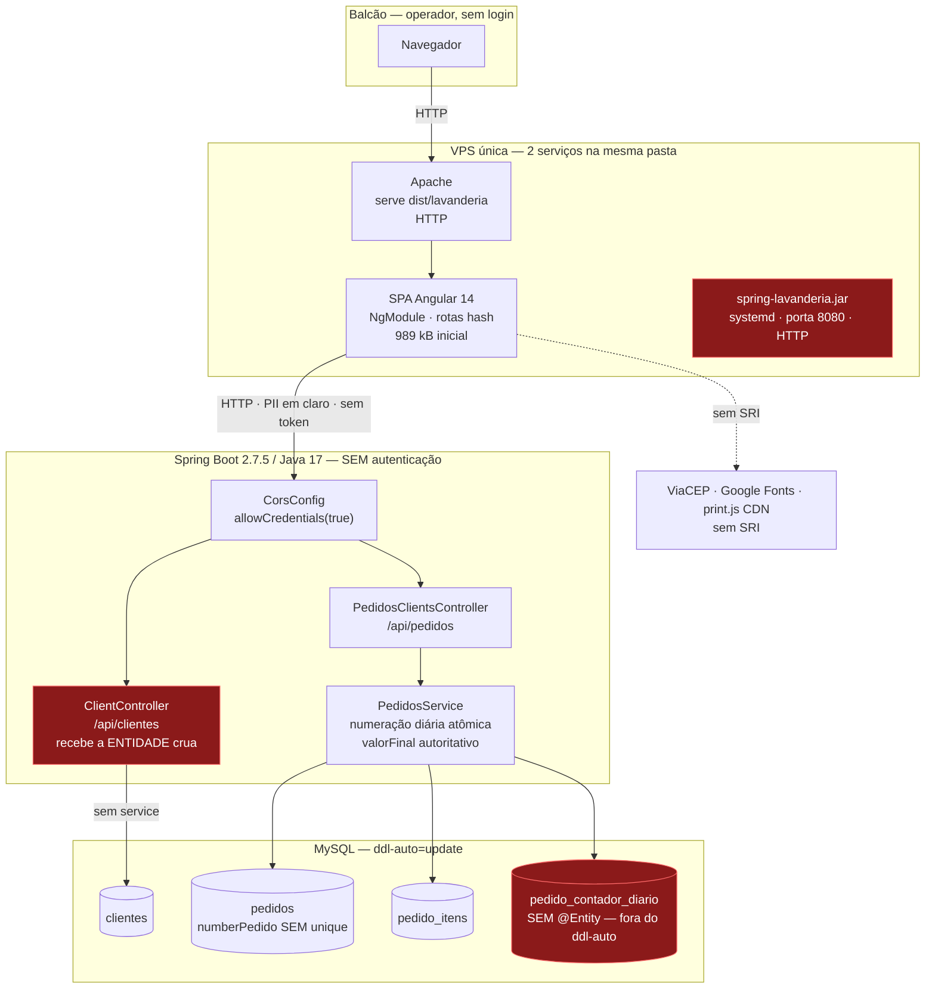
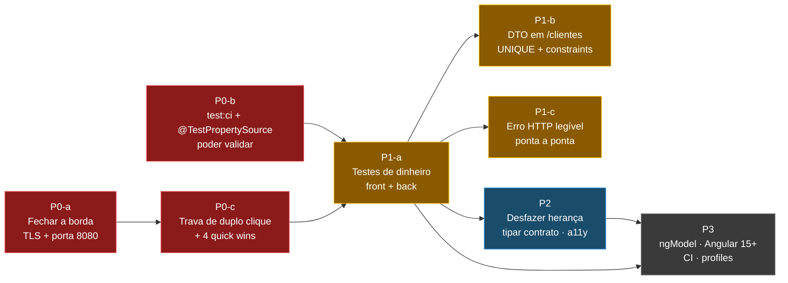

# Auditoria integral do sistema — Lavanderia Beltrão
### Consolidação sênior de backend/banco + frontend/integração + UX/UI

> **Versão pública sanitizada.** Contagens exatas derivadas do banco de produção e tamanhos precisos de artefato foram generalizados para publicação neste repositório. Achados, severidades, evidências de código e recomendações foram preservados.

> **Este documento é uma síntese de três auditorias já produzidas, não uma nova varredura.**
> Nenhum código, configuração, teste, dependência, banco, script ou relatório de origem foi
> alterado. A única escrita foi a criação deste arquivo, com caminho confirmado previamente.

---

## 1. Resumo executivo para decisão

Três auditorias independentes, todas do mesmo dia e dos mesmos commits, produziram **192 achados**.
Consolidados por causa-raiz, deduplicados e revalidados, restam **9 riscos que exigem decisão** e
uma ordem de execução que nenhum dos três relatórios podia enxergar sozinho — porque os dois piores
problemas do sistema **só existem na junção dos dois repositórios**.

**O que a consolidação descobriu que as fontes não viram:**

1. **`SYS-001` — o pedido duplicado é indetectável.** O frontend não trava o duplo clique
   (`FE-STATE-001`) e o backend não tem `UNIQUE` em `numberPedido` (`BE-DB-008`). Cada relatório
   classificou o seu lado como corrigível; juntos, produzem dois pedidos com números distintos,
   dois recibos entregues e **nenhuma chave que permita encontrá-los depois**. Revalidado: o botão
   Salvar é `type="submit"` sem `[disabled]`, e `numberPedido` é
   `@Column(length=200, nullable=false)` — **zero** `unique`/`uniqueConstraints` em qualquer
   entidade do backend.

2. **`SYS-002` — nenhum dos dois repositórios consegue validar uma mudança hoje.** No backend,
   `mvn test` sem seletor sobe contexto contra o banco real (`BE-TEST-001` — reconfirmado:
   `@SpringBootTest` puro, sem `@TestPropertySource`). No frontend, `npm test` não termina e falha
   10 de 15 (`FE-TEST-001`/`FE-TEST-003`). Ambos os `PROJECT_RULES.md` exigem essa validação antes
   de qualquer mudança. **A regra de segurança do projeto manda executar um comando que, de um
   lado, é destrutivo e, do outro, é impossível.**

**O que muda por causa da correção do alvo de deploy (VPS + Apache, HTTP):**

3. **`FE-OPS-001` está REJEITADO.** O relatório de frontend o elegeu *"achado de melhor relação
   impacto/esforço"* — corrigir 20→16 dígitos hex em `firebase.json`. Com o site servido por
   **Apache na VPS**, o `firebase.json` não está no caminho de entrega: a correção não entregaria
   nada. Sai dos quick wins e do P0.
4. **`FE-SEC-001` deixa de ser hipótese e vira fato.** O relatório apresentava duas possibilidades
   ("ou HTTPS com mixed content, ou HTTP em claro"). Confirmado: `environment.prod.ts` usa `http`
   (**zero** ocorrências de `https`) e o site é servido em HTTP → **PII em texto claro fim a fim**,
   sem TLS em nenhuma ponta, numa API sem autenticação que aceita `DELETE` de qualquer origem.
5. **Os artefatos Docker não descrevem produção.** `Dockerfile` termina em `nginx:alpine`;
   produção é Apache. `FE-OPS-002`/`FE-OPS-003` deixam de ser "corrigir o Dockerfile" e viram uma
   **decisão binária**: manter Docker como caminho real, ou apagar os dois arquivos.

**Veredito.** O sistema **não precisa de reescrita, migração de stack, CI, NgRx, Flyway ou
autenticação completa.** Precisa de três coisas, nesta ordem: *conseguir validar* → *parar de
perder e vazar dados* → *simplificar o que já existe*. Das 9 correções de maior valor, **7 são
esforço S** e reversíveis por `git revert`.

| | Backend | Frontend | UX/UI | **Consolidado** |
|---|:--:|:--:|:--:|:--:|
| Achados de origem | 55 | 51 | 86 | **192** |
| Após deduplicação | — | — | — | **~150 distintos** |
| Críticos normalizados | 2 | 5 | 9 | **9 clusters P0** |
| Rejeitados/rebaixados nesta consolidação | — | — | — | **6** |

---

## 2. Escopo, data, HEADs e limitações

### Fontes consolidadas

| # | Relatório | Repo | HEAD declarado | HEAD real | Compat. |
|:-:|---|---|---|---|:--:|
| 1 | `AUDITORIA-ARQUITETURA-BACKEND-BD-2026-07-27.md` | backend | `dcfcadf` (dev) | `dcfcadf0f7b0443b8…` | ✅ |
| 2 | `AUDITORIA-ARQUITETURA-FRONTEND-2026-07-27.md` | frontend | `ef9b264` (dev) | `ef9b26484c345c51…` | ✅ |
| 3 | `AUDITORIA-UX-UI-INTEGRAL-2026-07-27.md` | frontend | `ef9b264` (dev) | idem | ✅ |

**Nenhum código mudou desde as três auditorias** — as fontes são mutuamente comparáveis sem
reconciliação de baseline. Working tree de ambos os repos limpo, exceto os próprios relatórios como
arquivos não rastreados.

**Fontes deliberadamente não lidas:** `2026-07-08-auditoria-estrutura-pedidos.md` e
`2026-07-26-auditoria-ux-ui-v2.md` (históricos; a fonte 3 já declara quais partes do segundo estão
obsoletas e por quê).

### Escopo desta consolidação

- **Data:** 2026-07-27. **Modo:** somente leitura, exceto este arquivo.
- **Revalidação no código:** restrita a uma lista fechada (§ método, item 6 do prompt-mestre) —
  críticos, contradições e recomendações que alterariam contrato/schema/arquitetura. Executada por
  leitura direta e `grep`; **nenhum comando de build, teste, banco, deploy ou rede foi executado.**
- **Herdado das fontes, não reverificado:** todos os achados MÉDIOS, BAIXOS e de UX de polimento.
  Onde a fonte declarou "não testado" ou "não confirmado no projeto", essa marca é preservada.
- **PII:** nenhum dado real de cliente foi lido ou reproduzido. A URL de produção não é reproduzida
  aqui (apenas seu **esquema**), conforme `.claude/rules/seguranca-frontend.md`.

### Limitações que este documento não pode superar

Runtime **não foi executado por nenhuma das três auditorias** nem por esta. Toda severidade que
depende de observação em navegador ou de estado real da VPS permanece marcada.

---

## 3. Arquitetura atual

**Fronteiras de confiança e o que as protege hoje:**

| Fronteira | O que atravessa | Proteção |
|---|---|---|
| Navegador → Apache | Toda a aplicação | **Nenhuma** — HTTP |
| Navegador → API :8080 | Nome, telefone, endereço, itens, valores | **Nenhuma** — HTTP, sem auth, CRUD completo |
| Navegador → CDN terceiro | Executa JS na página que renderiza PII | **Nenhuma** — sem SRI |
| Navegador → WhatsApp Web | Telefone, nome, itens, total **na URL** | Função de negócio deliberada |
| DevTools / console | Nome, telefone, endereço, recibo | **Nenhuma** — 13 `console.log` no bundle |
| Validação client-side | — | É **UX**, não segurança: o endpoint é público |
| Backend → MySQL | Tudo | Credencial em `application.properties` versionado |

---

## 4. Sequência recomendada de evolução

**A dependência dura:** `P0-b` (poder validar) **bloqueia** todo o P1. Mexer em `formatarMoeda`,
`loopForTotais` ou `somarItens` sem teste é mexer no cálculo do dinheiro às cegas. Nenhuma tarefa
de P1 deve começar antes de `npm run test:ci` sair com código 0 e `./mvnw test` ser seguro.

---

## 5. Scorecard de maturidade do sistema (0–5)

Notas por dimensão, considerando o sistema inteiro e o porte real (uso interno de balcão, da ordem de milhares de
pedidos, um mantenedor).

| Dimensão | Back | Front | **Sistema** | Justificativa consolidada |
|---|:--:|:--:|:--:|---|
| A. Arquitetura e domínio | 3 | 2 | **2** | Numeração diária concorrente é exemplar; God Component de 634 linhas e herança acidental dominam o resto |
| B. Contrato de API e integração | 2 | 4 | **3** | Contrato casa nos pontos difíceis (numeração, `valorFinal`); perde por ausência de validação e erro cego |
| C. Banco e integridade de dados | 2 | — | **2** | Migrations manuais com rollback são disciplina rara; `ddl-auto=update` não cria a peça central |
| D. Segurança e privacidade | 1 | 1 | **1** | PII em claro, sem auth, CRUD público, credencial versionada, PII em console |
| E. Confiabilidade e observabilidade | 1 | 2 | **1** | Sem health check, sem log de erro útil, sem `ErrorHandler`, sem correlação |
| F. Testes e qualidade | 2 | 1 | **1** | Um lado destrutivo, outro impossível; regras financeiras sem nenhum teste dos dois lados |
| G. Performance e capacidade | 3 | 2 | **2** | `@EntityGraph` evita N+1; 16 formulários por tela e bundle a 35 kB do budget de erro |
| H. UX/UI e acessibilidade | — | 2 | **2** | 9 críticos, incluindo perda de dados digitados e exclusão sem confirmação |
| I. Operação e evolução | 2 | 2 | **2** | Deploy funciona e está documentado em prosa; nada versionado, sem ambiente separado |
| **Governança documental** | 4 | 5 | **5** | As rules descrevem o sistema com honestidade incomum, inclusive nos pontos incômodos |

**Média do sistema: 2,0 / 5.** O perfil é consistente: *o que foi decidido com cuidado está bem
feito e documentado; o que nunca foi decidido está ausente por completo.*

---

## 6. Riscos sistêmicos prioritários

Os 5 riscos abaixo são os únicos que podem causar **perda de dinheiro, perda de dados ou exposição
de terceiros**. Todo o resto é qualidade.

| # | Risco | Composição | Probabilidade | Impacto |
|:-:|---|---|---|---|
| 1 | **Pedido duplicado e indetectável** | `FE-STATE-001` + `BE-DB-008` | Alta (balcão, rede lenta) | Dois recibos, dois números, sem chave de reconciliação |
| 2 | **Vazamento de PII de clientes** | `FE-SEC-001` + `FE-SEC-002` + `BE-SEC-001` + `FE-SEC-003` | Alta (rede compartilhada) | Base inteira legível/apagável por qualquer um que ache o host |
| 3 | **Criação de pedidos parada por deploy** | `BE-DB-003` (Gate F pendente) | Alta se o runbook falhar | 100% do fluxo de escrita do negócio fora do ar |
| 4 | **Regressão silenciosa no valor cobrado** | `SYS-002` + `BE-TEST-003` + `FE-TEST-002` + `FE-FORM-001` | Média | Erro de centavos no recibo impresso e no WhatsApp, com build e teste verdes |
| 5 | **Perda do trabalho digitado pelo operador** | `UX-2.1-01` + `UX-2.1-06` + `UX-2.1-03` | Alta | Pedido inteiro apagado ao sair do campo Cliente; total zerado ao desmarcar pesagem |

---

## 7. Achados consolidados e deduplicados

Notação: `BE-*` = backend · `FE-*` = frontend/arquitetura · `UX-<tela>-<n>` = UX/UI (IDs cunhados
aqui — o relatório de origem numera por tela, sem ID; o número original é preservado).
Prefixos foram adicionados porque backend e frontend **usam os mesmos IDs para coisas diferentes**
(`SEC-001`, `TEST-001`, `API-001`, `DOC-002`, `OPS-006`).

### 7.1 P0 — correção obrigatória / contenção de risco

---

#### `SYS-001` · Pedido duplicado, com números distintos e sem chave para detectá-lo
- **Origem:** `FE-STATE-001` + `UX-2.1-02` + `BE-DB-008` — **achado novo desta consolidação**;
  nenhum relatório de origem juntou os dois lados.
- **Problema comprovado:** o botão Salvar é `type="submit"` **sem** `[disabled]` e sem flag de
  "salvando" (revalidado: `formulario.component.html:536`). Cada clique dispara `create()`. Como a
  numeração diária é atômica no servidor (ADR 0007), os dois pedidos recebem números **diferentes**.
  E `numberPedido` é `@Column(length=200, nullable=false)` — revalidado: **zero** `unique` ou
  `uniqueConstraints` em qualquer entidade do backend.
- **Agravante independente:** após o `POST`, `onBeforeSave` (`:586`) substitui tudo por
  `formulario.value`, e o `FormGroup` (`:57-99`) **não tem controle `id`** → corrigir um detalhe e
  salvar de novo cria um terceiro pedido, não um `PUT`.
- **Componente:** `formulario.component.ts/html` · `Pedidos.java` · `PedidosService`
- **Severidade:** CRÍTICA · **P0** · **Impacto:** integridade de dados + financeiro ·
  **Probabilidade:** alta
- **Esforço:** S (frontend) · **Dependências:** nenhuma · **Regressão:** botão preso se `error`
  não disparar — mitigar com `finalize`/`complete`
- **Breaking change:** não · **Schema/migration:** não (a UNIQUE em `numberPedido` **não** é
  recomendada — a ADR 0007 já a rejeitou com base em um número relevante de duplicatas legadas) · **ADR:** não
- **Aceite:** com throttling de rede, dois cliques rápidos produzem **um** `POST`; salvar duas
  vezes o mesmo pedido produz `POST` + `PUT`, não dois `POST`
- **Validação:** DevTools → Network · **Rollback:** `git revert`
- **Competência:** frontend Angular · **Recomendação: fazer agora** · **Confiança: alta**

---

#### `SYS-002` · Nenhum dos dois repositórios consegue validar uma mudança
- **Origem:** `BE-TEST-001` + `BE-DOC-002` + `FE-TEST-001` + `FE-TEST-003` + `FE-DOC-003`
- **Problema comprovado:**
  - **Backend:** `SpringLavanderiaApplicationTests` é `@SpringBootTest` puro — revalidado: sem
    `@TestPropertySource`, sem `@ActiveProfiles`. Carrega `application.properties` real. Se ele
    apontar para produção (7 documentos versionados convergem nisso), `ddl-auto=update` emite DDL
    contra dados de clientes reais. `PROJECT_RULES.md:41` publica `./mvnw test` como canônico.
  - **Frontend:** `npm test` não termina (`karma.conf.js:40-42` — `Chrome` com GUI,
    `singleRun:false`) e falha **10 de 15** por `NullInjectorError` (execução real da fonte 2).
  - **Documentação:** `PROJECT_RULES.md` do backend afirma em 3 lugares que a suíte roda 100% em
    H2 — **falso**, e é exatamente a classe que não roda.
- **Por que é P0 e não P2:** é o **pré-requisito de todo o P1**. Corrigir cálculo financeiro sem
  isso é trabalhar às cegas em campo monetário.
- **Severidade:** CRÍTICA · **P0** · **Esforço:** S+S (uma anotação + um script npm)
- **Dependências:** nenhuma · **Regressão:** nenhuma · **Breaking change:** não · **ADR:** não
- **Aceite:** `./mvnw test -Dtest=SpringLavanderiaApplicationTests` loga datasource `jdbc:h2:mem`;
  `npm run test:ci` termina com código de saída determinístico
- **Rollback:** reverter a anotação / remover o script
- **Competência:** backend Spring + frontend Angular · **Recomendação: fazer agora** ·
  **Confiança: alta**
- **Nota:** a fonte 1 **retirou** a alegação de que esse cenário "já ocorreu no passado" por não se
  sustentar na contagem de testes. Esta consolidação mantém a retirada — o risco é estrutural e
  confirmado; a materialização histórica **não está confirmada**.

---

#### `BE-DB-003` · `pedido_contador_diario` fora do alcance do `ddl-auto`; Gate F pendente
- **Origem:** `BE-DB-003` (CRÍTICA na fonte)
- **Problema comprovado:** revalidado — a tabela aparece **apenas** em native queries
  (`PedidosClientsRepository.java:47,58`); as entidades JPA são `Pedidos`, `PedidoItem` e `Client`.
  Não há `@Entity` para o contador → `ddl-auto=update` **não a cria**. A aplicação sobe normalmente
  e só falha no primeiro `POST`, com 500 sem mensagem útil.
- **Severidade:** CRÍTICA · **P0** · **Impacto:** indisponibilidade total do único fluxo de
  escrita do negócio · **Probabilidade:** alta se a ordem do runbook não for seguida
- **Esforço:** S · **Correção:** nenhuma mudança de código — garantir no runbook do Gate F que
  `01_schema_numeracao_diaria.sql` roda **e é verificado** antes do `systemctl start`
- **Schema/migration:** o script já existe · **ADR:** não (runbook já aprovado)
- **Aceite:** `POST /api/pedidos` real em homologação imediatamente após o deploy
- **Rollback:** N/A · **Competência:** operação/backend
- **Recomendação: fazer agora (verificar o estado real da VPS primeiro)** · **Confiança: alta**
- **Lacuna:** se o Gate F já foi executado no servidor é **não confirmado no projeto**.

---

#### `SYS-003` · PII de clientes em claro, numa API pública que aceita `DELETE`
- **Origem:** `FE-SEC-001` + `FE-SEC-002` + `BE-SEC-001` + `BE-SEC-003`/`FE-SEC-005` (CORS)
- **Conflito de severidade resolvido:** a fonte 1 classificou como **ALTA**; a fonte 2, como
  **CRÍTICA**. Normalizado para **CRÍTICA** — dado real de terceiros trafega em claro e é apagável
  sem credencial.
- **Hipótese fechada:** a fonte 2 apresentava duas possibilidades ("HTTPS com mixed content" ou
  "HTTP em claro"). **Confirmado: HTTP em claro.** `environment.prod.ts` usa esquema `http` —
  revalidado: **zero** ocorrências de `https`. Com Apache servindo em HTTP, **não há TLS em
  nenhuma das duas pontas**.
- **Problema comprovado:** 5 rotas sem `canActivate`; `providers: []`; nenhum Spring Security;
  `CorsConfig.addMapping("/**")` com `PUT/POST/DELETE` e `allowCredentials(true)` sem credencial
  alguma em uso. **CORS não é controle de acesso** — `curl -X DELETE …/api/pedidos/1` funciona sem
  origem.
- **Severidade:** CRÍTICA · **P0** · **Esforço:** S/M (**infraestrutura, não código**)
- **Recomendação mínima proporcional** — as três fontes convergem e esta consolidação confirma:
  **não** adotar SSO/OAuth/WAF/login na aplicação. O menor passo eficaz é de **borda**:
  1. fechar a porta 8080 para a internet;
  2. expor a API só via Apache como proxy reverso (`mod_proxy`), no mesmo host que já serve a SPA;
  3. TLS no Apache (Let's Encrypt) para SPA **e** API;
  4. restringir por IP/VPN da loja ou Basic auth no proxy;
  5. **então** trocar `http`→`https` em `environment.prod.ts` (uma linha — exige autorização
     explícita por `.claude/rules/seguranca-frontend.md`).
- **Ordem obrigatória:** o passo 5 **por último**. Trocar o esquema antes do TLS existir derruba a
  aplicação inteira.
- **Breaking change:** não (paths idênticos) · **ADR: sim** — muda contrato de ambiente
- **Aceite:** `https://…/api/pedidos` responde 200; a porta 8080 não responde da internet; nenhum
  aviso de mixed content
- **Rollback:** manter o vhost HTTP ativo durante a janela · **Risco:** indisponibilidade na
  janela; bloquear acesso legítimo se a allowlist estiver errada
- **Competência:** infraestrutura/sysadmin · **Recomendação: fazer agora (decisão do dono)** ·
  **Confiança: alta**

---

#### `UX-2.1-01` ≡ `FE-STATE-005` · Sair do campo Cliente apaga o pedido inteiro
- **Origem:** `UX-2.1-01` (crítico) + `FE-STATE-005` (MÉDIA/UX-CRÍTICA) — **severidades divergentes,
  normalizado para CRÍTICA** (a fonte 3 demonstrou que ultrapassa UX e vira integridade de dados).
- **Problema comprovado:** `consultarCliente()` faz `this.pedidosClientes = match`, onde `match` é
  um `Clientes` (9 campos, **sem** `total*`, `descricao*`, `valorFinal`). Como `pedidosClientes`
  está em `[(ngModel)]` de 40 campos, data, itens e valores viram `undefined`. Agravante:
  `match.id` é um **id de cliente** → o Salvar seguinte dispara `PUT /api/pedidos/{idDoCliente}`.
- **Alcançabilidade validada na fonte 3:** `setValue()` sem opções emite `ngModelChange`
  (`forms.mjs:3641-3646`), então `aplicarEstadoInicial` grava `pedidoRegistrado = true` e o `if` de
  `:251` é alcançado.
- **Severidade:** CRÍTICA · **P0** · **Esforço:** S · **Correção:** `patchValue` apenas dos campos
  de endereço/telefone, **sem `id`**
- **Aceite:** preencher itens, voltar ao campo Cliente, corrigir o nome e sair → os itens
  permanecem · **Risco:** autofill deixar de preencher algum campo
- **Breaking change:** não · **ADR:** não · **Competência:** frontend Angular
- **Recomendação: fazer agora** · **Confiança: alta** · **Runtime: não testado**

---

#### `UX-2.1-03` · Imprimir e Enviar Pedido viram no-op silencioso
- **Origem:** `UX-2.1-03` (crítico) — a fonte 2 registra a mesma falha como **duplicada** em
  `FE-ARCH-008` (o mesmo bug existe duas vezes, em código copiado).
- **Problema comprovado:** `ds` filtra com `!== null` (aceita string vazia), `totais` filtra com
  `!= null` (descarta). Os arrays saem com tamanhos diferentes e o laço chama `totais[i].toFixed(2)`
  sobre `undefined` → `TypeError` antes de abrir impressão/WhatsApp. **Gatilhos reais:** digitar a
  descrição e ainda não o valor; ou excluir um item (`removerItem` grava `descricao=''` mas
  `total=null`).
- **Severidade:** CRÍTICA · **P0** · **Esforço:** S (unificar o predicado) / M (se feito junto com
  `FE-ARCH-008`)
- **Dependência recomendada:** corrigir **nos dois lugares** ou extrair `montarResumoPedido()`
  antes — senão o histórico se repete (o commit `9b784cf` já teve de corrigir o mesmo bug duas
  vezes, e o próprio código documenta isso)
- **Aceite:** item com descrição sem total → Imprimir abre normalmente · **ADR:** não
- **Competência:** frontend Angular · **Recomendação: fazer agora** · **Confiança: alta** ·
  **Runtime: não testado**

---

#### `UX-2.2-27` ≡ `UX-2.4-46` · Excluir pedido e cliente sem nenhuma confirmação
- **Origem:** dois achados críticos idênticos, **unificados aqui**.
- **Problema comprovado:** revalidado — **zero** ocorrências de `MatDialog`, `window.confirm` ou
  `confirm(` em todo o `src/app/`. O botão "Deletar" fica colado no "Editar", ambos
  `btn btn-primary w-100`, visualmente idênticos. Exclusão irreversível, sem desfazer, sem
  histórico, **numa aplicação sem login que não registra autoria**.
- **Severidade:** CRÍTICA · **P0** · **Esforço:** S
- **Correção mínima:** um `confirm()` nativo com o número do pedido / nome do cliente já resolve.
  `MatDialog` é opcional e adiciona superfície — o Material já está no bundle, então nenhuma
  dependência nova em qualquer das duas opções.
- **Aceite:** clicar em Deletar exige confirmação explícita que nomeia o registro
- **Breaking change:** não · **ADR:** não · **Competência:** frontend Angular
- **Recomendação: fazer agora** · **Confiança: alta**

---

#### Quick wins P0 restantes (esforço S, sem dependência, reversíveis)

| ID consolidado | Origem | Ação | Ganho |
|---|---|---|---|
| `FE-FORM-003` | `FE-FORM-003` + `UX-2.1-04` + `UX-2.3-37` | `type="button"` em **2** botões Cancelar (`formulario.component.html:537`, `form-cliente.component.html:124`) | Cancelar deixa de cobrir a tela limpa de alertas vermelhos. **Não** se aplica a `busca-cep:73` (corrigido pelo validador da fonte 3) |
| `FE-SEC-003` | `FE-SEC-003` + `UX-2.1-25` | Remover **13** `console.log` com PII | Cumpre `.claude/rules/seguranca-frontend.md:16`. `angular.json` **não** remove console — os logs estão no bundle publicado |
| `FE-API-002` | `FE-API-002` + `BE-PERF-001` + `UX-2.4-48` + `UX-2.4-49` | `searchClientes(query)` no lugar de `listClient()` em `editar.component.ts:41` | Para de transferir a base inteira de clientes a cada busca — **é privacidade, não só performance**. O endpoint já existe e já tem consumidor |
| `FE-TEST-004` | `FE-TEST-004` | Remover `it('should render title')` de `app.component.spec.ts:29-34` | −1 falha na suíte; o template afirmado nunca existiu |
| `UX-2.8-67` | `UX-2.8-67` | `lang="pt-BR"` em `index.html:2` | Leitor de tela deixa de pronunciar português com fonética inglesa — afeta todas as telas de uma vez |

---

### 7.2 P1 — estabilidade, segurança, dados e contrato

| ID | Origem | Título | Sev. | Esf. | Depende de | ADR |
|---|---|---|:--:|:--:|---|:--:|
| `BE-SEC-002` | `BE-SEC-002` ≡ `FE-API-007` | **Mass assignment em `POST /api/clientes`** — revalidado: `create(@RequestBody Client client)` recebe a entidade crua com `id` público → `save()` faz *merge* e sobrescreve outro cliente respondendo 201. O padrão correto **já existe** em `PedidosRequestDTO` | ALTA | S | — | não |
| `FE-TEST-002` | `FE-TEST-002` | Testes das funções de dinheiro do frontend, **sem TestBed** (`cepValidator`, `loopForTotais`, `onChange`, `formatarMoeda`, `onBeforeSave`) | CRÍT | M | `SYS-002` | não |
| `BE-TEST-003` | `BE-TEST-003` + `BE-TEST-004` + `BE-TEST-006` | `valorFinal`/`somarItens`, tratamento de `""` e achatamento por `ordem` **sem nenhum teste** — as três regras centrais do dinheiro | ALTA | S | `SYS-002` | não |
| `FE-FORM-001` | `FE-FORM-001` | Normalização dos totais depende de **efeito colateral de timing**. Contrato financeiro correto *por acidente* | ALTA | S | `FE-TEST-002` | não |
| `SYS-004` | `FE-API-001` + `BE-API-002`/`BE-REL-001` | **Erro ilegível ponta a ponta:** o backend devolve `400 {"erro":"<motivo>"}` e o frontend descarta em 9 handlers → 400, 404, 0 e 500 produzem a mesma frase. Dois formatos de erro incompatíveis no servidor, sem `@ControllerAdvice` | ALTA | S/M | — | não |
| `BE-DB-005` | `BE-DB-005` | `UNIQUE(pedido_id, ordem)` existe só no SQL de produção; o `saveAndFlush` defensivo que ela motivou pode ser removido sem quebrar nenhum teste | ALTA | S | `SYS-002` | não |
| `BE-DB-006` | `BE-DB-006` | `uq_pedido_data_seq` invisível ao boot — a rede de segurança da numeração pode sumir num restore sem aviso | ALTA | S | — | não |
| `BE-DB-008` | `BE-DB-008` | Rollback da numeração diária pode reemitir um `numberPedido` já impresso. **Correção documental** no runbook (a ADR 0007 já decidiu não criar a UNIQUE) | ALTA | S | — | não |
| `FE-ARCH-001` | `FE-ARCH-001` + `FE-PERF-001` + `UX-2.7-65` | **Herança acidental:** `ErrorMsgComponent extends FormularioComponent` → 16 formulários e ~640 `FormControl` por tela para usar **1 método**. Maior alavanca de performance do app | CRÍT | S | — | não |
| `FE-ARCH-004` | `FE-ARCH-004` | Modo criar/editar decidido por **parsing da URL** (`window.location.hash`) → trocar por `@Input() modo` | ALTA | S/M | — | não |
| `UX-2.1-06` | `UX-2.1-06` | Desmarcar "Pesagem na Retirada" **zera o total digitado** — `setValue(0)` sem olhar `e.target.checked`; o valor é perdido de fato | ALTA | S | — | não |
| `UX-2.1-07` | `UX-2.1-07` | Recibo pode sair impresso com `Status: undefined` (cadeia `if/else if` sem `else`) | ALTA | S | — | não |
| `BE-SEC-005` | `BE-SEC-005` | Fat-jar de dezenas de MB versionado, possivelmente com `application.properties` congelado. **Verificar antes de decidir** | ALTA | S | — | não |
| `UX-2.5-53` | `UX-2.5-53` | `buscar-cep` **acumula** resultados entre buscas (arrays sem limpeza) — a tabela mistura ruas diferentes | ALTA | S | — | não |

### 7.3 P2 — testes, manutenibilidade, desempenho, UX e a11y

Agrupados por causa-raiz. Detalhe integral nas fontes.

- **Coesão do God Component:** `FE-ARCH-002` (634 linhas, 5 responsabilidades) ·
  `FE-ARCH-008` (~60 linhas duplicadas recibo/WhatsApp) · `FE-ARCH-003` (estado no DOM;
  `slotsVisiveis` é uma segunda verdade não usada) · `FE-ARCH-006` (`implements ChangeDetectorRef`
  com 5 métodos vazios — contrato falso herdado por 3 subclasses).
- **Acessibilidade:** `UX-2.1-05` (**6** botões com nome acessível errado — "delete"/"add" em
  inglês, numa ação destrutiva) · `UX-2.8-68` (nenhuma tela tem `<h1>`, exceto `buscar-cep`;
  `<title>` fixo) · `UX-2.7-64` (erro sem `aria-describedby`/`aria-invalid`) ·
  `UX-2.2-31`/`UX-2.4-51` (Editar/Deletar sem nome distinto por linha) · `UX-2.1-15` (foco perdido
  ao excluir item) · `UX-2.1-14` (contraste do botão WhatsApp **2,66:1**, reprova).
- **Estado e RxJS:** `FE-STATE-002` (`take(1)` nos 3 subscribes sem operador — **não** introduzir
  `takeUntil` em 11 lugares) · `FE-STATE-003` (vence a última resposta, não a última pergunta) ·
  `FE-STATE-004` (`loopForTotais` muta o modelo: clicar em Imprimir altera o formulário) ·
  `FE-STATE-006` + `UX-2.2-28` + `UX-2.8-71` (sem estado de carregamento nem estado vazio).
- **Contrato e integração:** `FE-API-004` (111 `any`/`@ts-ignore` neutralizando `strict:true` +
  `strictTemplates:true`; contrato duplicado à mão em 3 arquivos) · `FE-API-003` (`proxy.conf.js`
  é config morta que aponta o **dev para produção**) · `BE-API-001` (zero Bean Validation) ·
  `BE-TEST-015` (o único teste de contrato HTTP não verifica **nenhum** nome de campo JSON).
- **Dados:** `BE-DB-001`/`BE-REL-002` (sem `@Version` — edição concorrente apaga itens em
  silêncio) · `BE-DB-002` (arredondamento do item vs. da soma pode divergir em centavos) ·
  `BE-DB-011` (28 colunas legadas órfãs; `DROP` já decidido na ADR 0003, falta executar) ·
  `BE-DB-012` (`hibernate_sequence` compartilhada, já se perdeu uma vez num restore).
- **Operação:** `BE-OPS-011` (systemd só na VPS, duas configs concorrentes) · `BE-OPS-003`/`004`
  (sem log de erro útil, sem health check) · `BE-OPS-014`/`BE-DOC-004` (um dev novo não sobe o
  projeto com o que está versionado) · `FE-OPS-005` (sem observabilidade — **sem** Sentry, ver §15)
  · `FE-OPS-007` (os ADRs citados como normativos no frontend vivem no backend, sem indicação).
- **Visual/responsivo:** `UX-2.1-12` (linhas de item ilegíveis entre 576–991px) ·
  `UX-2.2-32`/`UX-2.4-51` (tabelas sem `.table-responsive`) · `UX-2.6-58` (menu mobile confinado em
  90 px) · `UX-2.1-20` (`ViewEncapsulation.None` vaza estilos globalmente — **e amplia o raio de
  qualquer atualização do Material**) · `UX-2.6-59`/`60` (navbar recarrega a SPA inteira;
  `aria-current` fixo no primeiro link) · `FE-PERF-002` (`aplicaCssErro` devolve objeto novo a cada
  verificação, × 16 instâncias) · `FE-PERF-003` (bundle a ~35 kB do budget de **erro**) ·
  `FE-PERF-004` (flags do zone.js ativas por um comentário fechado cedo demais).

### 7.4 P3 — modernização condicionada (só com gatilho)

`FE-FORM-002` (40 `ngModel`+`formControlName` — **pré-requisito obrigatório** do Angular 17+) ·
`FE-OPS-006` (Angular 14 e Node 16 fora de suporte) · `BE-OPS-012` (Spring Profiles) ·
`BE-OPS-006`/`FE-OPS-004` (CI/CD) · `BE-DB-010` (`data` como `String`) · `FE-TEST-006` (ESLint) ·
`FE-ARCH-005/007/009/010` · `FE-API-005/006` · `FE-DOC-001` a `FE-DOC-011`.

---

## 8. Contradições entre relatórios e como foram resolvidas

Seis. Todas arbitradas por evidência, não por antiguidade ou por voto.

| # | Contradição | Resolução |
|:-:|---|---|
| 1 | **Severidade da ausência de autenticação:** fonte 1 = ALTA; fonte 2 = CRÍTICA | **CRÍTICA.** Dado real de terceiros, apagável sem credencial, em rede aberta |
| 2 | **`FE-OPS-001` é o melhor quick win do projeto** (fonte 2) | **REJEITADO.** Deploy é Apache/VPS; `firebase.json` não está no caminho de entrega. A aritmética 20≠16 está correta (revalidada), mas **inconsequente** |
| 3 | **`FE-SEC-001`: HTTPS com mixed content OU HTTP em claro?** (fonte 2 deixou aberto) | **HTTP em claro**, confirmado: `environment.prod.ts` com esquema `http`, zero `https`, e Apache servindo em HTTP |
| 4 | **`UX-2.1-26`: "`total*` sai como string com vírgula no POST"** × **`FE-FORM-001`: "o POST sai com o tipo correto"** | **A fonte 2 prevalece.** Ela arbitrou no código-fonte do Angular (`forms.mjs` — `updateModel` é síncrono) o que a fonte 3 marcou como *"não confirmado no projeto"*. `UX-2.1-26` é **superado**; o risco real é de *timing*, registrado em `FE-FORM-001` |
| 5 | **`BE-PERF-002` (ALTA): paginação com `@EntityGraph` pagina em memória** × **`FE-API-005` (BAIXA): paginação nunca usada** | **Rebaixado para BAIXA/latente.** Revalidado: `data-crud.service.ts` **não envia `page` nem `size` em nenhuma chamada**. O custo descrito não é pago por ninguém hoje. Vira pré-requisito de *quando* a paginação for adotada, não tarefa autônoma |
| 6 | **`FE-OPS-002`/`003`: "corrigir o Dockerfile"** × alvo real de deploy | **Reformulado.** `Dockerfile` termina em `nginx:alpine`; produção é **Apache**. Os artefatos Docker não descrevem nem reproduzem produção → a decisão é **binária**: adotar Docker de verdade, ou apagar `Dockerfile` + `docker-compose.yml`. Corrigir a porta `3000:3000`→`80:80` num caminho morto é trabalho perdido |

**Duas hipóteses já refutadas nas fontes — não reabrir:** o recibo impresso **não** sai em branco
(cloning steps da spec HTML preservam o valor do `textarea`); `PedidosComponent.ngOnInit()` **não**
estoura `TypeError` (no Ivy o DOM da subárvore existe antes do `ngOnInit` do pai — verificado em
runtime na auditoria de 2026-07-26).

---

## 9. Matriz do contrato frontend ↔ backend

O contrato **está correto nos dois pontos que mais importam**, e ambos os lados confirmam:
a numeração diária nasce no `POST` e é adotada da resposta (sem pré-busca de `next-number`), e
`valorFinal` é autoritativo no servidor (o front envia, o servidor descarta e recalcula com
`somarItens`).

**Riscos remanescentes do contrato, por ordem de probabilidade:**

| Risco | Evidência | Achado |
|---|---|---|
| **Nulabilidade divergente** — 12 campos declarados não-opcionais no TS chegam nuláveis do servidor (`cep`, `cidade`, `rua`, `numCasa`, `bairro`, `complemento`, `quantidade1..5`, `descricao1..5`, 3 flags). Revalidado: apenas **9 de 42** campos do model são opcionais | `pedidos-clientes.ts` × DTOs | `FE-API-006` |
| **Rename de IDE = breaking change silencioso** — Lombok `@Data` gera os nomes JSON a partir dos nomes de campo Java, e **nenhum teste verifica nome de campo** | `BE-TEST-015` | `BE-TEST-015` |
| **`entrega_estimada` é o único campo `snake_case`** do contrato — convite a uma "correção" que quebraria o frontend em silêncio | — | `BE-API-003` |
| **`total*`: `string \| number` no TS × `BigDecimal` no DTO** — funciona por round-trip de `ngModel` | `FE-FORM-001` | `FE-FORM-001` |
| **Campos-fantasma:** `numberPedido` aceito no Request e nunca usado; `textarea` e `search` (controles de UI) vão no corpo do `POST` | `BE-API-003`, `FE-FORM-007` | ambos |

**Recomendação de menor custo:** 2–3 `jsonPath` nos testes de controller já existentes, ancorando
`numberPedido` e `valorFinal` (`BE-TEST-015`, esforço S). Isso protege o contrato inteiro contra a
classe de erro mais provável — um refactor de nomes.

---

## 10. Integridade e evolução do banco

A **disciplina de migração é o ponto mais maduro do sistema** — 7 ADRs, scripts idempotentes com
rollback ensaiado, ordem documentada em runbook. Não trocar por Flyway/Liquibase (§15).

O risco não está nos scripts; está no que `ddl-auto=update` **não faz** e ninguém verifica:

| Operação | `update` faz? | Consequência aberta |
|---|:--:|---|
| Criar coluna nova em entidade existente | sim | — |
| Criar tabela sem `@Entity` | **não** | `BE-DB-003` — **CRÍTICO**, Gate F pendente |
| Criar `UNIQUE`/índice não declarado em JPA | **não** | `BE-DB-005`, `BE-DB-006` |
| Alterar tipo de coluna existente | **não** | `BE-DB-014` (`TINYINT` × `Integer`) |
| Remover coluna órfã | **não** | `BE-DB-011` (28 colunas legadas) |
| **Validar o schema no boot** | **não** | **nenhum dos itens acima dispara alerta no startup** |

**A última linha é a causa-raiz de tudo nesta seção.** A evolução natural — `ddl-auto=validate` —
está **bloqueada** por `BE-DB-014` (drift de tipo) e exigiria as constraints declaradas em JPA. Não
é para agora, mas é o estado-alvo correto e deve ser registrado como tal.

**Continuidade:** `BE-OPS-013` — não há evidência de backup agendado; as ADRs só descrevem backups
pontuais ligados a cutover, e um deles tem pendência aberta de mover para fora da VPS. **É o maior
risco de continuidade do negócio e não é um problema de código.** Confirmar com o responsável é
tarefa de 5 minutos com o maior retorno esperado deste relatório.

---

## 11. Segurança e privacidade

Consolidado em `SYS-003` (§7.1). Complementos que não cabem lá:

| Item | Situação | Achado |
|---|---|---|
| PII no console do navegador | 13 `console.log` com nome, telefone, endereço e recibo completo, **no bundle publicado** (`angular.json` não faz drop de console) | `FE-SEC-003` |
| Credencial de banco versionada | `application.properties` e `scripts/setup_mysql_user.sh` em texto claro; rotação já registrada como pendência | rules do backend |
| Fat-jar de dezenas de MB no Git | Pode conter cópia congelada do `application.properties`. **Não foi aberto** (seria leitura indireta de arquivo protegido) | `BE-SEC-005` |
| Mass assignment | `POST /api/clientes` aceita a entidade com `id` | `BE-SEC-002` |
| CDN sem SRI | A página que renderiza PII executa JS de terceiro sem verificação de integridade — e a lib **já está no bundle** | `FE-SEC-004` |
| `allowCredentials(true)` | Sem nenhuma credencial em uso; inócuo hoje, perigoso no dia em que houver auth por cookie | `FE-SEC-005` |
| **XSS** | **Sem risco** — registrado para evitar retrabalho. Zero `bypassSecurityTrust*`, `[innerHTML]` ou `eval`; toda PII passa por interpolação escapada | `FE-SEC-006` |

**Nota de proporcionalidade:** nenhum dos três relatórios recomenda autenticação na aplicação, e
esta consolidação concorda. Para uma ferramenta de balcão com um operador, **fechar a borda é mais
eficaz, mais barato e mais reversível** que construir login — e não toca o código.

---

## 12. UX/UI e acessibilidade

Os 9 críticos da fonte 3, com o que a consolidação acrescenta:

| UX | Sintoma | Causa estrutural | Destino |
|:--:|---|---|:--:|
| 1 | Sair do campo Cliente apaga o pedido | `FE-STATE-005` + `FE-ARCH-004` | **P0** |
| 2 | Salvar duas vezes cria pedido duplicado | `FE-STATE-001` + `BE-DB-008` → `SYS-001` | **P0** |
| 3 | Imprimir/WhatsApp viram no-op | `FE-ARCH-008` (a falha existe **duas vezes**) | **P0** |
| 4 / 37 | Cancelar dispara submit | `FE-FORM-003` | **P0** |
| 5 | 6 botões com nome acessível errado | Template de 542 linhas com 5 blocos copiados | P2 |
| 27 / 46 | Deletar sem confirmação | Nenhuma camada de confirmação no projeto (revalidado: zero) | **P0** |
| 53 | Buscar CEP acumula resultados | Arrays não limpos | P1 |
| 58 | Menu mobile confinado em 90 px | SCSS de altura fixa | P2 |

**Acessibilidade — o que é barato e o que não é.** `lang="pt-BR"` (uma linha, afeta todas as telas)
e `aria-hidden="true"` nos `mat-icon` dos 6 botões destrutivos são os dois de maior retorno. `<h1>`
por tela e `aria-describedby` exigem tocar todos os templates — P2.

**O que a auditoria de UX verificou e descartou** (registrado para não virar retrabalho): contraste
das tabelas está correto; foco visível **não** é removido por CSS; `label`/`for` está correto em
todos os campos; `<th scope="col">` presente em todas as tabelas; budgets de SCSS não são violados;
o fluxo da ADR 0007 é cumprido corretamente pelo frontend.

**Runtime continua não testado.** A fonte 3 deixou um roteiro de 10 passos priorizado — é o
caminho mais barato para fechar as severidades que dependem de observação (achados 12, 32, 51, 58,
61 e a manifestação dos `TypeError` de 3 e 30).

---

## 13. Testes, observabilidade, performance e operação

**Testes.** Ver `SYS-002`. Além do bloqueio, as regras de negócio centrais **não têm teste em
nenhum dos dois lados**: `valorFinal`/`somarItens`, tratamento de `""` como slot vazio (bug já
ocorrido em produção), achatamento por `ordem`, `formatarMoeda`, `loopForTotais`, `onBeforeSave`.

**Padrão positivo a preservar e replicar:** os testes de concorrência da numeração diária
(`PedidosClientsRepositoryTest`) são o ponto mais forte do sistema — independência de ordem por
datas literais distintas, sem `Thread.sleep`, com `CountDownLatch`. Vale documentar como convenção
obrigatória para novos testes com banco.

**Observabilidade.** Praticamente ausente dos dois lados: 2 chamadas de log no backend inteiro
(ambas no caminho feliz), zero `ErrorHandler`/`HttpInterceptor`/`catchError` no frontend, sem
Actuator, sem correlação. Quando um pedido falha ao salvar no balcão, **não há como saber por quê**
— nem no cliente, nem remotamente. A correção proporcional é `SYS-004` (usar o erro que já chega),
não uma ferramenta externa.

**Performance.** A maior alavanca é `FE-ARCH-001` (16 formulários por tela), muito acima de
`trackBy`, `OnPush` ou lazy loading. No backend, `@EntityGraph` já evita N+1; as buscas são full
scan mas custam frações de segundo com milhares de linhas — **gatilho futuro**, não tarefa. `FE-PERF-003` é o único
risco operacional real: o bundle está a ~35 kB do budget de **erro**, então qualquer adição modesta
quebra o build de produção.

**Operação.** Deploy manual documentado só em prosa; systemd só na VPS, com **duas configurações
concorrentes que já causaram confusão** (`BE-OPS-011`); um único `application.properties` para
todos os ambientes (`BE-OPS-012`); backend e frontend **compartilham a mesma pasta na VPS** — todo
runbook de publicação do frontend precisa excluir os artefatos do backend, sob pena de derrubar o
serviço. Isso não está versionado em lugar nenhum e **deveria estar**.

---

## 14. Divergências documentação × código

| Onde | Divergência | Sev. |
|---|---|:--:|
| `PROJECT_RULES.md` (backend), 3 linhas | Afirma que a suíte roda 100% em H2 — **falso**, e é exatamente a classe que não roda | ALTA |
| `.claude/rules/seguranca-frontend.md:16` | "Não logar dados de clientes em produção" × 13 `console.log` com PII no bundle | ALTA |
| `PROJECT_RULES.md:33-34` (frontend) | `npm ci` é canônico × `Dockerfile` roda `npm install` sem copiar o lock | ALTA |
| `README.md:19` (frontend) | "Run `ng test`" × o comando não termina e falha 10 de 15 | ALTA |
| `.claude/rules/fluxo-pedidos-relatorios.md` | `valorFinal` do backend é autoritativo × recibo e WhatsApp **recalculam o total localmente** | MÉDIA |
| `docs/adr/` (frontend) | Código e rules citam ADR 0007 como normativo em 6 pontos; o diretório só tem o TEMPLATE — os ADRs vivem **no backend**, sem indicação aqui | MÉDIA |
| `.claude/skills/architecture-review/SKILL.md` (backend) | Descreve o projeto como "sem service, sem testes, sem migrations" — as **três** premissas são falsas hoje | MÉDIA |
| `.claude/commands/revisar-api-spring.md` | Cita `GET /next-number`, removido no Gate D | BAIXA |
| `firebase.json`, `angular.json:117` | Configuração de Firebase Hosting mantida num projeto que **publica por Apache/VPS** | **nova** |

**Fechada nesta consolidação:** a fonte 3 apontava a memória do projeto como desatualizada quanto a
`PedidosClientes` (`retirada*`/`entrega_estimada`). **Já corrigida** — a memória registra o ponto
como resolvido no commit `e85ffc2`.

**Registro de honestidade documental:** os dois repositórios declaram corretamente vários pontos
incômodos (proxy não exercido, ausência de lint, `@angular/fire` instalado e não usado no app,
contrato baseado em DTO e não em entidade). Isso é acima da média e deve ser preservado.

---

## 15. Não fazer agora — e o gatilho de cada um

Cada item já foi rejeitado por pelo menos uma das fontes. Esta consolidação **confirma todas as
rejeições** e acrescenta duas.

| Proposta | Por que não agora | Gatilho |
|---|---|---|
| **Autenticação na aplicação** | Desproporcional. Fechar a borda é mais eficaz, mais barato, reversível e não toca o código | Exposição externa inevitável por necessidade de negócio |
| **CI/CD** | Seria vermelho por `SYS-002`; e um CI ingênuo com credencial de produção aplicaria **DDL a cada push** | `SYS-002` resolvido **e** segundo colaborador |
| **Flyway / Liquibase** | Os scripts manuais atuais são idempotentes, com rollback e ordem documentada — **funcionam** | Equipe crescer ou múltiplos ambientes reais |
| **Spring Profiles** | A correção pontual de `SYS-002` já neutraliza o risco imediato | Segundo ambiente real (homolog permanente) |
| **`ddl-auto=validate`** | Bloqueado por `BE-DB-014` (drift de tipo) e pelas constraints não declaradas em JPA | Depois de `BE-DB-005`/`006`/`014` |
| **NgRx / state management** | Zero estado compartilhado entre rotas; abstração para nenhum caso de uso | Estado real compartilhado entre 3+ telas |
| **`HttpInterceptor` global** | 11 call sites, todos já com branch de erro; `SYS-004` resolve com menos indireção | Header comum (auth) ou 20+ chamadas |
| **`retry` automático** | **Perigoso aqui:** `POST /api/pedidos` não é idempotente — cada chamada incrementa a sequência diária. Retry **criaria** o duplicado de `SYS-001` | Nunca para POST |
| **`OnPush` / `trackBy` / lazy loading** | `markForCheck()` é um **no-op** herdado (`FE-ARCH-006`) — `OnPush` falharia em silêncio | Depois de `FE-ARCH-001`, se o profiler ainda acusar |
| **`FormArray` para os itens** | O achatamento em 6 slots **é o contrato do backend** | Backend expor `itens[]` no DTO |
| **Atualização major do Angular** | Migrar com a suíte atual é migrar às cegas; Material 15 (MDC) + `ViewEncapsulation.None` amplia o raio | CVE explorável, ou necessidade de API v15+ — **e** `FE-TEST-002` pronto |
| **ESLint com preset completo** | Centenas de erros viram ruído ignorado | Quando houver CI |
| **Observabilidade externa (Sentry)** | PII real sairia do perímetro; dependência nova barrada por rule | Nunca sem anonimização e autorização |
| **Standalone / signals** | Nenhum diagnóstico deste relatório depende disso | Só junto de migração major autorizada |
| **`UNIQUE(numberPedido)`** *(novo)* | A ADR 0007 já rejeitou: um número relevante de duplicatas no legado impedem. `SYS-001` se resolve no frontend | Backfill do legado, que ninguém pediu |
| **Corrigir `firebase.json` / Dockerfile** *(novo)* | Nenhum dos dois está no caminho de entrega (Apache/VPS). Corrigir caminho morto é trabalho perdido | Decisão explícita de adotar Firebase ou Docker |

---

## 16. Roadmap P0–P3

**P0 — contenção de risco imediato**
`SYS-003` (fechar a borda — decisão do dono) · `SYS-002` (poder validar) · `BE-DB-003` (verificar
o estado real da VPS) · `SYS-001` (trava de duplo clique) · `UX-2.1-01` · `UX-2.1-03` ·
`UX-2.2-27`/`UX-2.4-46` · `FE-FORM-003` · `FE-SEC-003` · `FE-API-002` · `FE-TEST-004` · `UX-2.8-67`

**P1 — estabilidade, segurança, dados e contrato**
`BE-SEC-002` · `FE-TEST-002` · `BE-TEST-003`/`004`/`006` · `FE-FORM-001` · `SYS-004` ·
`BE-DB-005`/`006`/`008` · `FE-ARCH-001` · `FE-ARCH-004` · `UX-2.1-06`/`07` · `UX-2.5-53` ·
`BE-SEC-005` · `BE-TEST-015`

**P2 — testes, manutenibilidade, desempenho e UX**
Blocos da §7.3 na ordem: coesão → a11y → estado/RxJS → contrato → dados → operação → visual

**P3 — modernização condicionada**
`FE-FORM-002` → `FE-OPS-006` (nesta ordem obrigatória) · `BE-OPS-012` · CI/CD · `BE-DB-010` ·
`FE-TEST-006` · higiene (`FE-ARCH-005/007/009/010`, `FE-DOC-*`)

---

## 17. Plano 48h / 7d / 30d / 60d / 90d

### Primeiras 48 horas — **sem escrever uma linha de código**

1. **Verificar `BE-DB-003` na VPS:** `pedido_contador_diario` existe? O Gate F foi executado? As
   próprias queries de conferência do script respondem isso.
2. **Confirmar `BE-OPS-013`:** existe backup agendado do MySQL? *(maior risco de continuidade do
   negócio; 5 minutos para responder)*
3. **Decidir `SYS-003`:** fechar a porta 8080 e colocar TLS no Apache — é a única decisão que não
   pode esperar e não depende de código.
4. **Verificar `BE-SEC-005`:** o fat-jar versionado contém credencial? Se sim, rotação de senha
   entra no plano de 7 dias.

*Critério de saída: as quatro perguntas respondidas por escrito.*

### Primeiros 7 dias — parar de sangrar

5. `SYS-002`: `@TestPropertySource` no backend + script `test:ci` no frontend. **Bloqueia tudo o
   que vem depois.**
6. `SYS-001`: flag `salvando` + `[disabled]`.
7. `UX-2.2-27`/`UX-2.4-46`: confirmação antes de excluir.
8. Quick wins: `FE-FORM-003`, `FE-SEC-003`, `FE-API-002`, `FE-TEST-004`, `UX-2.8-67`.
9. Executar o TLS decidido no passo 3 — **`environment.prod.ts` por último**.

*Critério de saída: `npm run build` verde; `npm run test:ci` termina; nenhuma PII no console; dois
cliques em Salvar produzem um pedido; a API não responde da internet.*

### 30 dias — construir a rede de segurança

10. `FE-TEST-002` (funções de dinheiro, sem TestBed) e `BE-TEST-003`/`004`/`006`.
11. `UX-2.1-01`, `UX-2.1-03`, `UX-2.1-06`, `UX-2.1-07`, `UX-2.5-53`.
12. `BE-SEC-002` (DTO em `/clientes`) e `BE-TEST-015` (2–3 `jsonPath`).
13. `BE-DOC-002` + `FE-DOC-003` — corrigir a documentação **depois** que ela virar verdade.

*Critério de saída: alterar `formatarMoeda`, `loopForTotais` ou `somarItens` quebra um teste.*

### 60 dias — reduzir o acoplamento

14. `FE-FORM-001` (normalizar no form) e `FE-STATE-004` — **primeiro o teste, depois a mudança**.
15. `FE-ARCH-001` (desfazer a herança) — maior alavanca de performance do app.
16. `SYS-004` (erro legível ponta a ponta) e `BE-DB-005`/`006`/`008`.
17. `BE-OPS-011` (versionar o `.service`) e o runbook de publicação do frontend **com a exclusão
    dos artefatos do backend** — a pasta é compartilhada.

*Critério de saída: um erro de validação do backend chega legível ao operador; a tela de pedido
instancia 2 formulários, não 16.*

### 90 dias — coesão

18. `FE-ARCH-008` (extrair `montarResumoPedido` — elimina a duplicação que já causou o mesmo bug
    duas vezes) e `FE-ARCH-003` (estado fora do DOM).
19. `FE-ARCH-004` (`@Input() modo`) e `FE-API-004` (tipar **um** ponto de entrada e medir).
20. Bloco de acessibilidade da §7.3.
21. Decidir e registrar em ADR: `FE-PERF-004` (flags do zone), `FE-API-003` (proxy),
    `FE-OPS-002`/`003` (Docker: adotar ou apagar), `firebase.json` (manter ou remover).

*Critério de saída: `formulario.component.ts` abaixo de ~400 linhas, sem `document.querySelector`
para estado, e as decisões pendentes registradas.*

### Depois de 90 dias — só com gatilho

`FE-FORM-002` → `FE-OPS-006` (nesta ordem, ambos exigem `FE-TEST-002` pronto e ADR) ·
`BE-OPS-012` · CI/CD · `ddl-auto=validate` · `BE-DB-010`.

---

## 18. Riscos de implementação e rollback

| Mudança | Risco de fazer | Rollback |
|---|---|---|
| Trava de duplo clique | Botão preso se `error` não disparar | `git revert` — usar `finalize`/`complete`, não só `next`/`error` |
| TLS + fechar porta 8080 | Indisponibilidade na janela; bloquear acesso legítimo | Manter o vhost HTTP ativo até o HTTPS ser validado |
| `environment.prod.ts` http→https | **Quebra a aplicação inteira se feito antes do TLS existir** | Reverter uma linha e rebuild |
| `patchValue` no autofill | Autofill deixar de preencher algum campo | `git revert` |
| Normalizar totais no form | **Campo financeiro** — exige `FE-TEST-002` **antes** | `git revert` + o teste que provou o comportamento |
| Desfazer a herança do `ErrorMsgComponent` | Regressão visual nas 14 mensagens de erro | `git revert` |
| DTO em `POST /api/clientes` | Contrato de entrada muda (só perde `id`) | Reverter o controller |
| `@TestPropertySource` | Nenhum | Remover a anotação |
| Confirmação antes de excluir | Nenhum | `git revert` |

**Regra geral herdada das rules dos dois repositórios e reafirmada aqui:** toda mudança que toca
`DataCrudService`, `environment*.ts`, valores financeiros ou o contrato com o backend **exige
autorização explícita** antes de qualquer alteração — inclusive as classificadas como quick win.

---

## 19. ADRs necessários

| # | Decisão | Por quê | Quando |
|:-:|---|---|---|
| 1 | **Exposição da API e TLS** (`SYS-003`) | Muda contrato de ambiente; irreversível na prática (rotação de URL) | 48h |
| 2 | **Firebase, Docker e Apache: qual é o caminho oficial** | Três caminhos de publicação configurados, **um** em uso. Enquanto não for decidido, todo achado de deploy é ambíguo | 30 dias |
| 3 | **Qual das duas configurações systemd da VPS é a oficial** (`BE-OPS-011`) | Duas configs concorrentes já causaram confusão uma vez | 60 dias |
| 4 | **Flags do zone.js** (`FE-PERF-004`) | Alteram detecção de mudanças globalmente, sem registro em lugar nenhum | 90 dias |
| 5 | **Remoção de `ngModel`+`formControlName`** (`FE-FORM-002`) | Vira convenção do projeto e é pré-requisito de Angular 17+ | Antes de executar |
| 6 | **Spring Profiles por ambiente** (`BE-OPS-012`) | Mudança estrutural | Com gatilho |

---

## 20. Lacunas de evidência

Nenhuma bloqueia o P0. Todas devem aparecer como marca explícita em qualquer decisão que dependa
delas.

| Lacuna | Como fechar | Bloqueia |
|---|---|---|
| Estado real de `pedido_contador_diario` na VPS (Gate F) | Rodar as queries de conferência do próprio script | `BE-DB-003` |
| Existência de backup agendado do MySQL | Perguntar ao responsável | Continuidade do negócio |
| Conteúdo de `application.properties` (`ddl-auto`, host) | Leitura autorizada pelo dono | Confiança de `SYS-002` |
| Conteúdo do fat-jar versionado | Inspeção autorizada | `BE-SEC-005` |
| **Runtime da SPA — nunca executado por nenhuma das 4 auditorias** | Roteiro de 10 passos da fonte 3, §6 | Severidade de `UX-2.1-12`, `32`, `51`, `58`, `61`, `3`, `30` |
| Corpo real do `POST /api/pedidos` | DevTools → Network | Fecha `FE-FORM-001` |
| Se o CSS do CDN é usado pelo recibo | Imprimir com a rede do CDN bloqueada | `FE-SEC-004` |
| `HHH000104` e duplicação sem `DISTINCT` | Runtime do backend | `BE-PERF-002` (já rebaixado), `BE-DB-013` |
| Se `lavanderia.png` (372 kB) é logo previsto | Perguntar ao dono | `FE-PERF-006` |

---

## 21. Definição objetiva do estado-alvo "nível sênior"

Para **este** sistema — uso interno de balcão, milhares de registros, um mantenedor — nível sênior
**não** é microsserviços, Kubernetes, NgRx, Flyway, CI ou autenticação federada. As três fontes
convergem nisso e esta consolidação confirma.

É, objetivamente, **seis condições verificáveis**:

1. **Rodar o comando de validação documentado nunca é uma operação destrutiva nem impossível.**
   Hoje: `./mvnw test` pode aplicar DDL em produção; `npm test` não termina. *(`SYS-002`)*
2. **Uma ação repetida por engano não cria dado que ninguém consegue encontrar depois.**
   Hoje: dois cliques = dois pedidos, dois números, nenhuma chave. *(`SYS-001`)*
3. **Dado pessoal de terceiro não trafega em claro nem é apagável sem credencial.**
   Hoje: HTTP fim a fim, `DELETE` público. *(`SYS-003`)*
4. **Alterar o cálculo do dinheiro quebra um teste.**
   Hoje: `valorFinal`, `somarItens` e `formatarMoeda` não têm nenhum. *(`FE-TEST-002`, `BE-TEST-003`)*
5. **Quando algo falha no balcão, é possível saber o quê.**
   Hoje: 400, 404, 0 e 500 produzem a mesma frase. *(`SYS-004`)*
6. **A peça que falta no deploy é verificada antes de liberar o serviço, não descoberta pelo
   primeiro cliente.** *(`BE-DB-003`)*

**O sistema já demonstra a capacidade de fazer engenharia nesse nível** — a numeração diária
concorrente, com lock de linha desenhado, testado sob concorrência real e corrigido, é
desproporcionalmente mais robusta que tudo ao seu redor. E os ADRs registram alternativas
rejeitadas e achados negativos com honestidade, o que é raro em qualquer porte. As lacunas deste
relatório não são sinais de descuido generalizado: são, em boa parte, **pontos cegos criados pelas
próprias proteções do projeto** (`BE-TEST-001` existe porque o bloqueio de leitura de secrets
impediu a solução mais simples) ou **dívidas conscientes ainda não pagas** (Gate F, `DROP` da
ADR 0003).

**O caminho é: primeiro conseguir validar, depois parar de vazar e perder dados, depois
simplificar — e só então evoluir a stack.**

---

## 22. Próximos três passos recomendados

1. **Responder às quatro perguntas de 48 horas (§17).** Nenhuma exige código; duas
   (`BE-DB-003`, `BE-OPS-013`) podem revelar um risco maior que qualquer achado deste relatório.
2. **Executar `SYS-002`** — uma anotação no backend, um script no frontend. Sem isso, todo o P1 é
   trabalho às cegas em campo financeiro, e nenhuma correção posterior pode ser validada.
3. **Decidir `SYS-003`** — é a única decisão do dono que não pode esperar, não depende de código e
   não é reversível por `git revert`.

Só depois disso vale abrir qualquer tarefa de refatoração.

---

## 23. Nota metodológica final

**Esta consolidação não alterou nada.** Nenhum código, configuração, teste, dependência, banco,
script ou relatório de origem foi modificado. A única escrita foi a criação deste arquivo, com o
caminho confirmado previamente com o responsável.

**O que foi revalidado no código** (lista fechada, conforme autorizado): `BE-TEST-001`
(`@SpringBootTest` puro, confirmado), `BE-DB-003` (contador sem `@Entity`, confirmado),
`BE-DB-008` (`numberPedido` sem `unique`; **zero** `uniqueConstraints` em todo o backend,
confirmado), `BE-SEC-002` (entidade crua no `@RequestBody`, confirmado), `FE-STATE-001` (botão sem
`[disabled]`, confirmado), `FE-API-005` (**nenhum** `page`/`size` enviado, confirmado →
`BE-PERF-002` rebaixado), `FE-SEC-001` (esquema `http`, zero `https`, confirmado), `FE-OPS-001`
(padrão de 20 hex confirmado, mas **inconsequente** no caminho de entrega real),
`UX-2.2-27`/`UX-2.4-46` (zero `MatDialog`/`confirm`, confirmado), `FE-API-006` (9 de 42 campos
opcionais no model TS, confirmado).

**O que foi rejeitado, rebaixado ou reformulado:** 6 itens, todos em §8, com a evidência que
sustenta cada decisão.

**Nenhum achado das fontes foi descartado em silêncio.** Os que não aparecem individualmente aqui
estão agrupados por causa-raiz em §7.3 e §7.4, com o ID de origem preservado para rastreabilidade
até o relatório que os produziu.

*As correções derivadas deste documento são tarefa separada e devem seguir
`.claude/rules/raciocinio-e-arquitetura.md` dos respectivos repositórios.*
